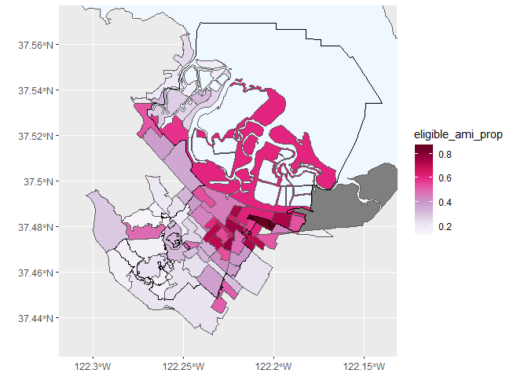

city\_redwood
================
Kate Ham
2/14/2020

``` r
# Libraries
library(tidyverse)
```

    ## -- Attaching packages -------------------------------------------------------------------------------------- tidyverse 1.3.0 --

    ## v ggplot2 3.2.1     v purrr   0.3.3
    ## v tibble  2.1.3     v dplyr   0.8.3
    ## v tidyr   1.0.2     v stringr 1.4.0
    ## v readr   1.3.1     v forcats 0.4.0

    ## -- Conflicts ----------------------------------------------------------------------------------------- tidyverse_conflicts() --
    ## x dplyr::filter() masks stats::filter()
    ## x dplyr::lag()    masks stats::lag()

``` r
library(sf)
```

    ## Linking to GEOS 3.6.1, GDAL 2.2.3, PROJ 4.9.3

``` r
library(readxl) # part of the tidyverse


# Files
acs_rwc_file <- "C:/Users/katea/GitHub/dcl-2020-01/kate/c01-own/data/acs_rwc.rds"
boundaries_cbg_city_redwood_file <- "C:/Users/katea/GitHub/dcl-2020-01/kate/c01-own/data/boundaries_cbg_city_redwood.rds"
boundaries_city_redwood_file <- "C:/Users/katea/GitHub/dcl-2020-01/kate/c01-own/data/boundaries_city_redwood.rds"
bayarea_water_shp <- "C:/Users/katea/GitHub/dcl-2020-01/kate/c01-own/data-raw/stanford-qh320kj0191-shapefile/qh320kj0191.shp"
cl_city_redwood_file <- "C:/Users/katea/GitHub/dcl-2020-01/kate/c01-own/data/cl_city_redwood.rds"
xlsx_file <- "C:/Users/katea/GitHub/dcl-2020-01/kate/c01-own/data-raw/Bulk_Tax_Current_Layout w parcel level lat long_03102016.xlsx"
```

Read in relevant files.

``` r
acs_rwc <- read_rds(acs_rwc_file)
boundaries_cbg_city_redwood <- read_rds(boundaries_cbg_city_redwood_file)
boundaries_city_redwood <- read_rds(boundaries_city_redwood_file) # EPSG 4269 datum NAD83
bayarea_water <- st_read(bayarea_water_shp) %>% st_transform(st_crs(boundaries_city_redwood))
```

    ## Reading layer `qh320kj0191' from data source `C:\Users\katea\GitHub\dcl-2020-01\kate\c01-own\data-raw\stanford-qh320kj0191-shapefile\qh320kj0191.shp' using driver `ESRI Shapefile'
    ## Simple feature collection with 1917 features and 1 field
    ## geometry type:  POLYGON
    ## dimension:      XY
    ## bbox:           xmin: -123.712 ymin: 36.49999 xmax: -121 ymax: 39
    ## epsg (SRID):    4326
    ## proj4string:    +proj=longlat +datum=WGS84 +no_defs

``` r
cl_city_redwood <- read_rds(cl_city_redwood_file)

data_dic_luse <- 
  read_excel(xlsx_file, sheet = "LUSE") %>% 
  transmute(
    luse_code = as.double(`CdVal`),
    luse_desc = `CdDesc`
  )
```

The ACS data includes estimates for total household income in the past
12 months (in 2018 dollars), from table B19001. This is the list of the
variables:

  - ‘B19001\_001’ - Total
  - ‘B19001\_002’ - Less than $10 000
  - ‘B19001\_003’ - $10 000 to $14 999
  - ‘B19001\_004’ - $15 000 to $19 999
  - ‘B19001\_005’ - $20 000 to $24 999
  - ‘B19001\_006’ - $25 000 to $29 999
  - ‘B19001\_007’ - $30 000 to $34 999
  - ‘B19001\_008’ - $35 000 to $39 999
  - ‘B19001\_009’ - $40 000 to $44 999
  - ‘B19001\_010’ - $45 000 to $49 999
  - ‘B19001\_011’ - $50 000 to $59 999
  - ‘B19001\_012’ - $60 000 to $74 999
  - ‘B19001\_013’ - $75 000 to $99 999
  - ‘B19001\_014’ - $100 000 to $124 999
  - ‘B19001\_015’ - $125 000 to $149 999
  - ‘B19001\_016’ - $150 000 to $199 999
  - ‘B19001\_017’ - $200 000 or more

For our purposes, we are only interested in incomes at the threshold
determined by Redwood City’s relocation assistance policy. On the city’s
[renter protections
webpage](https://www.redwoodcity.org/departments/community-development-department/planning-housing/renter-protections)
under “Relocation Assistance Highlights” it says:

> Eligible residential households include a displaced residential
> household whose annual income **does not exceed eighty percent of the
> area median household income** for San Mateo County as adjusted for
> household size according to the United States Department of Housing
> and Urban Development and whose rental payments to the landlord remain
> current through the date of displacement. \[^1\]

The city’s AMI limits can be found
[here](https://www.redwoodcity.org/home/showdocument?id=16686). Income
limits are also determined by household size.

The average household size in Redwood City (according to ACS 2018 5-year
data) was 2.8 persons. For the purposes of this EDA analysis, we will
generalize to a household size of 3 across the entire city. This would
generalize 80% AMI to $105,700.

The ACS does not have household incomes with such precision, but we will
generalize 80% AMI to $100,000. Create a new variable that counts the
number of households making below $100,000 and the proportion of
eligibility.

``` r
acs_rwc2 <- 
  acs_rwc %>%
  mutate(
    eligible_ami = 
      rowSums(
        select(., matches("00[2-9]$|01[1-3]$"))
      ),
    eligible_ami_prop =
      eligible_ami / B19001_001
  )
```

With this data, we can find out what proportion of Redwood City
households are eligible for tenant relocation assistance upon being
evicted. Keep in mind that the policy also has eligibility requirements
by number of dwelling units in the building, so this proportion should
be considered a relative maximum.

``` r
weighted.mean(acs_rwc2$eligible_ami_prop, w = acs_rwc2$B19001_001)
```

    ## [1] 0.4008577

Join ACS data to block group boundaries. This makes the ACS data a
spatial object. Then turn it into an sf object.

``` r
acs_rwc_sf <- 
  acs_rwc2 %>% 
  left_join(
    boundaries_cbg_city_redwood %>% select(`GEOID`, geometry),
    by = "GEOID"
  ) %>% 
  st_as_sf()
```

Let’s visualize …

``` r
acs_rwc_sf %>% 
  ggplot() +
  geom_sf(aes(fill = eligible_ami_prop)) +
  scale_fill_gradientn(colors = RColorBrewer::brewer.pal(n = 9, name = "PuRd")) +
  geom_sf(data = bayarea_water %>% st_filter(boundaries_city_redwood, .predicate = st_intersects), fill = "aliceblue") +
  geom_sf(data = boundaries_city_redwood, color = "black", fill = NA, size = 0.2) +
  coord_sf(
    xlim = c(-122.31, -122.14),
    ylim = c(37.43, 37.57)
  )
```

    ## although coordinates are longitude/latitude, st_intersects assumes that they are planar

<!-- -->

For a more accurate depiction of eligiblity, we should include the other
restrictions as stated on the website:

> Rental units not included in the City’s ordinance include a room or
> any portion of a residential unit which is occupied by the landlord, a
> mobile home, properties of **four or fewer dwelling units** located on
> one lot, including single-family, duplex, tri-plex, or four-plex homes
> and accessory dwellings, mobile homes or housing accommodation in
> hotels, motels, etc.

Create a universe of residential properties in RWC and count their land
uses.

``` r
cl_city_redwood_res <- 
  cl_city_redwood %>% 
  filter(property_indicator %in% c(10, 11)) %>% 
  left_join(data_dic_luse, by = c("land_use" = "luse_code"))

cl_city_redwood_res
```

    ## Simple feature collection with 2483 features and 66 fields
    ## geometry type:  POINT
    ## dimension:      XY
    ## bbox:           xmin: -122.2761 ymin: 37.44864 xmax: -122.1836 ymax: 37.54823
    ## epsg (SRID):    4269
    ## proj4string:    +proj=longlat +datum=NAD83 +no_defs
    ## # A tibble: 2,483 x 67
    ##    fips_code unformatted_apn apn_sequence_nbr formatted_apn original_apn
    ##    <chr>     <chr>                      <dbl> <chr>         <chr>       
    ##  1 06081     058357040                      1 058-357-040   058357040   
    ##  2 06081     069123300                      1 069-123-300   069123300   
    ##  3 06081     134161251                      1 134-161-251   134161251   
    ##  4 06081     134161260                      1 134-161-260   134161260   
    ##  5 06081     134161280                      1 134-161-280   134161280   
    ##  6 06081     134161290                      1 134-161-290   134161290   
    ##  7 06081     134161310                      1 134-161-310   134161310   
    ##  8 06081     134161321                      1 134-161-321   134161321   
    ##  9 06081     134161330                      1 134-161-330   134161330   
    ## 10 06081     134162020                      1 134-162-020   134162020   
    ## # ... with 2,473 more rows, and 62 more variables: `p-id-iris-frmtd` <chr>,
    ## #   total_value_calculated_ind <chr>, land_value_calculated_ind <chr>,
    ## #   improvement_value_calculated_ind <chr>, situs_state <chr>,
    ## #   owner1_last_name <chr>, mail_city <chr>, mail_state <chr>,
    ## #   `parcel_level_latitude_(2.6)` <dbl>, `parcel_level_longitude_(3.6)` <dbl>,
    ## #   mail_zip_code <chr>, census_tract <dbl>, mail_street_name <chr>,
    ## #   tax_code_area <dbl>, land_use <dbl>, property_indicator <chr>,
    ## #   county_use1 <chr>, land_square_footage <dbl>, acres <dbl>,
    ## #   mail_carrier_code <chr>, situs_city <chr>, situs_zip_code <dbl>,
    ## #   situs_street_name <chr>, assessed_year <dbl>, total_value_calculated <dbl>,
    ## #   assd_total_value <dbl>, tax_amount <dbl>, tax_year <dbl>,
    ## #   land_value_calculated <dbl>, assd_land_value <dbl>,
    ## #   mail_house_number <dbl>, situs_mode <chr>, situs_house_number <dbl>,
    ## #   situs_carrier_code <chr>, mail_mode <chr>, assd_improvement_value <dbl>,
    ## #   improvement_value_calculated <dbl>, absentee_owner_status <chr>,
    ## #   number_of_units <dbl>, universal_building_square_feet <dbl>,
    ## #   building_square_feet_ind <chr>, building_square_feet <dbl>,
    ## #   year_built <dbl>, lot_number <chr>, stories_number <dbl>, `batch-id` <dbl>,
    ## #   `batch-seq` <dbl>, document_type <chr>, transaction_type <dbl>,
    ## #   total_baths_calculated <dbl>, recording_date <dbl>, total_baths <dbl>,
    ## #   total_rooms <dbl>, bedrooms <dbl>, living_square_feet <dbl>,
    ## #   `owner1_first_name_&_mi` <chr>, sale_code <chr>, seller_name <chr>,
    ## #   sale_price <dbl>, residential_model_indicator <chr>, geometry <POINT [°]>,
    ## #   luse_desc <chr>
