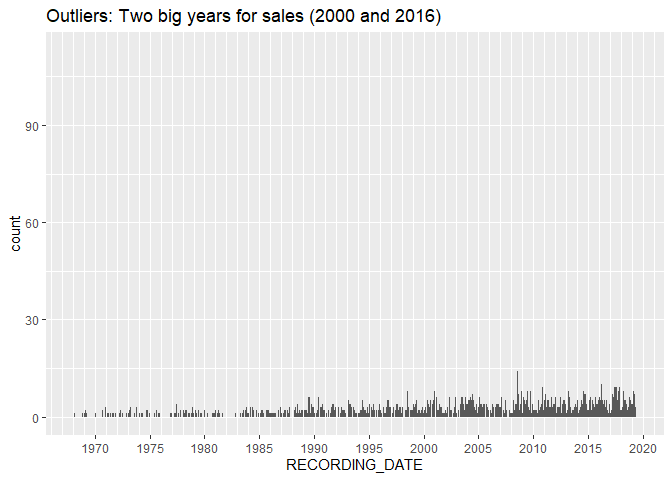

EPA Property EDA with CoreLogic
================
Kate Ham
2020-03-22

  - [Description](#description)
  - [Setup](#setup)
  - [Property Stock EDA](#property-stock-eda)
      - [How old are EPA properties?](#how-old-are-epa-properties)
      - [Current sales info](#current-sales-info)
          - [Woodland Park - outlier](#woodland-park---outlier)
          - [2000 outlier?](#outlier)
          - [Recording dates without
            outliers](#recording-dates-without-outliers)
          - [Spatial distribution of sales since
            2010](#spatial-distribution-of-sales-since-2010)
          - [Sales by Type of Home](#sales-by-type-of-home)
          - [Parcel Value](#parcel-value)
      - [Selecting Parcels](#selecting-parcels)

Prepared for: Karen Camacho

# Description

The following is a draft exploratory data analysis (EDA) report for the
property stock in the City of East Palo Alto using CoreLogic taxroll
parcel data from 2019 in order to estimate which properties would be
best suited for a CLT. Note the most recent data is 06-06-2019, and only
residential properties are included.

NOTE TO SELF: Lookup prior research on NOAH.

# Setup

``` r
# Libraries
library(tidyverse)
library(lubridate)
library(sf)
library(leaflet)

# Parameters
corelogic <- read_rds(here::here("c01-own/data-raw/all9counties.rds"))
best_vars <-   read_rds(here::here("c01-own/data/best_vars.rds"))
boundaries_city_epa <- read_rds(here::here("c01-own/data/boundaries_city/boundaries_city_east_palo_alto.rds"))
file_data_dic <- here::here("c01-own/data-raw/Bulk_Tax_Current_Layout w parcel level lat long_03102016.xlsx")

  # Property Indicator filter
RESIDENTIAL <- c(0:199)
  # recode function
recode_county <- function(county_fips) {
  county_fips %>% 
    recode(
      '06001' = "alameda",
      '06013' = "contra_costa", 
      '06041' = "marin",
      '06055' = "napa", 
      '06075' = "san_francisco",
      '06081' = "san_mateo",
      '06085' = "santa_clara",
      '06095' = "solano",
      '06097' = "sonoma" 
    )
}
#===============================================================================

luse_codes <- 
  file_data_dic %>% 
  readxl::read_excel(sheet = "LUSE") %>% 
  transmute(
    luse_code = `CdVal`,
    luse_desc = `CdDesc`
  )
```

The following code chunks clean and create a file of all the residential
properties in EPA with select variables (less than 25% missing values).

``` r
cl_select <-
  corelogic %>%
  select(best_vars, contains("MORTGAGE")) %>% 
  filter(LAND_USE %in% RESIDENTIAL) %>% 
  mutate(RECORDING_DATE = ymd(RECORDING_DATE)) %>% 
  mutate(county = recode_county(FIPS_CODE))
```

    ## Warning: 17168 failed to parse.

NOTE: Parsing failures are for properties without sales transaction
recording dates.

``` r
cl_epa <- 
  cl_select %>% 
  filter(county == "san_mateo") %>% 
  mutate(
    lat = PARCEL_LEVEL_LATITUDE__2_6_,
    long = PARCEL_LEVEL_LONGITUDE__3_6_
  ) %>% 
  drop_na(lat, long) %>% 
  st_as_sf(coords = c("long", "lat"), crs = 4326, agr = "constant") %>% 
  st_transform(st_crs(boundaries_city_epa)) %>% 
  st_filter(boundaries_city_epa, .predicate = st_within) %>% 
  left_join(luse_codes, by = c("LAND_USE" = "luse_code"))
```

    ## although coordinates are longitude/latitude, st_within assumes that they are planar

NOTE TO SELF: Double check if this is the number of residential
properties in EPA with the census\!

``` r
cl_epa %>% 
  ggplot() +
  geom_sf(data = boundaries_city_epa, aes(color = "EPA")) +
  geom_sf(size = 1, shape = 23, fill = "darkred") +
  labs(
    colour = "Legend",
    title = "CoreLogic Property Universe for EPA"
  )
```

<!-- -->

# Property Stock EDA

## How old are EPA properties?

``` r
cl_epa %>%
  ggplot() +
  geom_histogram(aes(YEAR_BUILT), binwidth = 10) +
  scale_x_continuous(breaks = scales::breaks_width(10), minor_breaks = NULL) +
  labs(
    title = "Most EPA properties were built in the 1950s."
  )
```

    ## Warning: Removed 101 rows containing non-finite values (stat_bin).

<!-- --> NOTE TO SELF:
Ask Karen why this is? What’s with the slight bump in the 2000s?

## Current sales info

``` r
cl_epa %>% 
  ggplot() +
  geom_histogram(aes(RECORDING_DATE), binwidth = 10) +
  scale_x_date(breaks = seq(ymd(19300101), ymd(20200101), by = "5 years"), date_labels = "%Y", minor_breaks = "1 year") +
  labs(
    title = "Outliers: Two big years for sales (2000 and 2016)"
  )
```

    ## Warning: Removed 551 rows containing non-finite values (stat_bin).

<!-- --> Next let’s examine the
two outliers:

#### Woodland Park - outlier

``` r
cl_epa %>% 
  filter(year(RECORDING_DATE) == 2016, OWNER1_LAST_NAME == "WOODLAND PARK PROPERTY OWNER LLC") %>% 
  select(RECORDING_DATE, OWNER1_LAST_NAME, DOCUMENT_TYPE, SITUS_HOUSE_NUMBER, SITUS_STREET_NAME, YEAR_BUILT, SALE_PRICE, SELLER_NAME) %>% 
  knitr::kable()
```

| RECORDING\_DATE | OWNER1\_LAST\_NAME               | DOCUMENT\_TYPE | SITUS\_HOUSE\_NUMBER | SITUS\_STREET\_NAME | YEAR\_BUILT | SALE\_PRICE | SELLER\_NAME           | geometry                  |
| :-------------- | :------------------------------- | :------------- | :------------------- | :------------------ | ----------: | ----------: | :--------------------- | :------------------------ |
| 16854           | WOODLAND PARK PROPERTY OWNER LLC | GD             | 1827                 | CLARKE              |        1949 |      920000 | EQR-WOODLAND PARK B LP | c(-122.135119, 37.454812) |
| 16854           | WOODLAND PARK PROPERTY OWNER LLC | GD             | 1908                 | CAPITOL             |        1925 |      318000 | EQR-WOODLAND PARK B LP | c(-122.140169, 37.457957) |
| 16854           | WOODLAND PARK PROPERTY OWNER LLC | GD             | 1820                 | CLARKE              |        1952 |      470500 | EQR-WOODLAND PARK B LP | c(-122.134162, 37.454812) |
| 16854           | WOODLAND PARK PROPERTY OWNER LLC | GD             | 1875                 | WOODLAND            |        1941 |      622500 | EQR-WOODLAND PARK B LP | c(-122.131588, 37.45426)  |
| 16854           | WOODLAND PARK PROPERTY OWNER LLC | GD             | 2032                 | EUCLID              |        1938 |      367500 | EQR-WOODLAND PARK A LP | c(-122.144105, 37.461101) |
| 16854           | WOODLAND PARK PROPERTY OWNER LLC | GD             | 1669                 | WOODLAND            |        1938 |      598500 | EQR-WOODLAND PARK LP   | c(-122.139709, 37.456429) |
| 16854           | WOODLAND PARK PROPERTY OWNER LLC | GD             | 1787                 | WOODLAND            |        1948 |      420000 | EQR-WOODLAND PARK B LP | c(-122.13512, 37.454519)  |
| 16854           | WOODLAND PARK PROPERTY OWNER LLC | GD             | 1821                 | CLARKE              |        1949 |      582500 | EQR-WOODLAND PARK B LP | c(-122.13477, 37.454781)  |
| 16854           | WOODLAND PARK PROPERTY OWNER LLC | GD             | 1523                 | WOODLAND            |        1939 |      818000 | EQR-WOODLAND PARK A LP | c(-122.144418, 37.458723) |
| 16854           | WOODLAND PARK PROPERTY OWNER LLC | GD             | 1785                 | WOODLAND            |        1922 |      476000 | EQR-WOODLAND PARK B LP | c(-122.135395, 37.454483) |
| 16854           | WOODLAND PARK PROPERTY OWNER LLC | GD             | 1773                 | WOODLAND            |        1949 |      540500 | EQR-WOODLAND PARK LP   | c(-122.136121, 37.454534) |
| 16854           | WOODLAND PARK PROPERTY OWNER LLC | GD             | 640                  | CIRCLE              |        1950 |      501000 | EQR-WOODLAND PARK LP   | c(-122.139523, 37.456831) |
| 16854           | WOODLAND PARK PROPERTY OWNER LLC | GD             | 1805                 | CLARKE              |        1940 |      391500 | EQR-WOODLAND PARK B LP | c(-122.134776, 37.454563) |
| 16854           | WOODLAND PARK PROPERTY OWNER LLC | GD             | 1871                 | WOODLAND            |        1938 |      310000 | EQR-WOODLAND PARK B LP | c(-122.131713, 37.454356) |
| 16854           | WOODLAND PARK PROPERTY OWNER LLC | GD             | 1902                 | CAPITOL             |        1912 |      840500 | EQR-WOODLAND PARK B LP | c(-122.140313, 37.457823) |
| 16854           | WOODLAND PARK PROPERTY OWNER LLC | GD             | 1908                 | COOLEY              |        1947 |      507500 | EQR-WOODLAND PARK LP   | c(-122.138753, 37.455364) |
| 16854           | WOODLAND PARK PROPERTY OWNER LLC | GD             | 1703                 | WOODLAND            |        1948 |      840000 | EQR-WOODLAND PARK LP   | c(-122.138718, 37.455174) |
| 16854           | WOODLAND PARK PROPERTY OWNER LLC | GD             | 1839                 | WOODLAND            |        1957 |      550500 | EQR-WOODLAND PARK B LP | c(-122.132604, 37.454563) |
| 16854           | WOODLAND PARK PROPERTY OWNER LLC | GD             | 1848                 | CLARKE              |        1958 |      631000 | EQR-WOODLAND PARK B LP | c(-122.134161, 37.455262) |
| 16854           | WOODLAND PARK PROPERTY OWNER LLC | GD             | 1807                 | WOODLAND            |        1957 |      572000 | EQR-WOODLAND PARK B LP | c(-122.134168, 37.454658) |
| 16854           | WOODLAND PARK PROPERTY OWNER LLC | GD             | 1823                 | WOODLAND            |        1957 |      554500 | EQR-WOODLAND PARK B LP | c(-122.1333, 37.454733)   |
| 16854           | WOODLAND PARK PROPERTY OWNER LLC | GD             | 1835                 | WOODLAND            |        1957 |      550500 | EQR-WOODLAND PARK B LP | c(-122.132795, 37.454609) |
| 16854           | WOODLAND PARK PROPERTY OWNER LLC | GD             | 2044                 | EUCLID              |        1949 |      706500 | EQR-WOODLAND PARK A LP | c(-122.14403, 37.461491)  |
| 16854           | WOODLAND PARK PROPERTY OWNER LLC | GD             | 504                  | OCONNOR             |        1953 |      652000 | EQR-WOODLAND PARK A LP | c(-122.144109, 37.460183) |
| 16854           | WOODLAND PARK PROPERTY OWNER LLC | GD             | 1940                 | EUCLID              |        1922 |     3622500 | EQR-WOODLAND PARK A LP | c(-122.144279, 37.459086) |
| 16854           | WOODLAND PARK PROPERTY OWNER LLC | GD             | 1986                 | EUCLID              |        1948 |      988500 | EQR-WOODLAND PARK A LP | c(-122.144336, 37.459945) |
| 16854           | WOODLAND PARK PROPERTY OWNER LLC | GD             | 1643                 | WOODLAND            |        1952 |      777000 | EQR-WOODLAND PARK LP   | c(-122.140009, 37.456747) |
| 16854           | WOODLAND PARK PROPERTY OWNER LLC | GD             | 2033                 | MANHATTAN           |        1961 |     4387000 | EQR-WOODLAND PARK A LP | c(-122.14361, 37.461273)  |
| 16854           | WOODLAND PARK PROPERTY OWNER LLC | GD             | 1965                 | MANHATTAN           |        1949 |     2607000 | EQR-WOODLAND PARK A LP | c(-122.143793, 37.459551) |
| 16854           | WOODLAND PARK PROPERTY OWNER LLC | GD             | 1920                 | COOLEY              |          NA |    17789000 | EQR-WOODLAND PARK B LP | c(-122.138779, 37.456221) |
| 16854           | WOODLAND PARK PROPERTY OWNER LLC | GD             | 402                  | OKEEFE              |        1963 |    15001000 | EQR-WOODLAND PARK A LP | c(-122.146563, 37.461491) |
| 16854           | WOODLAND PARK PROPERTY OWNER LLC | GD             | 395                  | OKEEFE              |        1959 |    10541500 | EQR-WOODLAND PARK A LP | c(-122.146518, 37.462485) |
| 16854           | WOODLAND PARK PROPERTY OWNER LLC | GD             | 1846                 | BAYSHORE            |        1959 |     2077500 | EQR-WOODLAND PARK B LP | c(-122.132414, 37.45483)  |
| 16854           | WOODLAND PARK PROPERTY OWNER LLC | GD             | 1955                 | MANHATTAN           |        1958 |     3604000 | EQR-WOODLAND PARK A LP | c(-122.143824, 37.459329) |
| 16854           | WOODLAND PARK PROPERTY OWNER LLC | GD             | 1949                 | COOLEY              |        1949 |     2225000 | EQR-WOODLAND PARK B LP | c(-122.139492, 37.458301) |
| 16854           | WOODLAND PARK PROPERTY OWNER LLC | GD             | 201                  | OKEEFE              |        1962 |     5217500 | EQR-WOODLAND PARK LP   | c(-122.14997, 37.462701)  |
| 16854           | WOODLAND PARK PROPERTY OWNER LLC | GD             | 1941                 | COOLEY              |        1959 |     3137500 | EQR-WOODLAND PARK B LP | c(-122.139489, 37.458091) |
| 16854           | WOODLAND PARK PROPERTY OWNER LLC | GD             | 1901                 | MANHATTAN           |        1948 |     4019500 | EQR-WOODLAND PARK A LP | c(-122.143889, 37.458694) |
| 16854           | WOODLAND PARK PROPERTY OWNER LLC | GD             | 2025                 | EUCLID              |        1961 |     1009000 | EQR-WOODLAND PARK A LP | c(-122.144787, 37.461037) |
| 16854           | WOODLAND PARK PROPERTY OWNER LLC | GD             | 360                  | OKEEFE              |        1964 |     6140000 | EQR-WOODLAND PARK A LP | c(-122.147262, 37.461623) |
| 16854           | WOODLAND PARK PROPERTY OWNER LLC | GD             | 1920                 | COOLEY              |        1963 |    17789000 | EQR-WOODLAND PARK B LP | c(-122.138221, 37.456233) |
| 16854           | WOODLAND PARK PROPERTY OWNER LLC | GD             | 2012                 | EUCLID              |        1954 |     4451500 | EQR-WOODLAND PARK A LP | c(-122.144144, 37.460899) |
| 16854           | WOODLAND PARK PROPERTY OWNER LLC | GD             | 466                  | OKEEFE              |        1964 |     8705500 | EQR-WOODLAND PARK A LP | c(-122.145491, 37.461333) |
| 16854           | WOODLAND PARK PROPERTY OWNER LLC | GD             | 1838                 | BAYSHORE            |        1957 |     2219500 | EQR-WOODLAND PARK B LP | c(-122.132824, 37.454998) |
| 16854           | WOODLAND PARK PROPERTY OWNER LLC | GD             | 1991                 | MANHATTAN           |        1959 |     5148000 | EQR-WOODLAND PARK A LP | c(-122.143773, 37.459791) |
| 16854           | WOODLAND PARK PROPERTY OWNER LLC | GD             | 245                  | OKEEFE              |        1963 |     6092500 | EQR-WOODLAND PARK LP   | c(-122.148898, 37.46255)  |
| 16854           | WOODLAND PARK PROPERTY OWNER LLC | GD             | 1820                 | BAYSHORE            |        1959 |    13565500 | EQR-WOODLAND PARK B LP | c(-122.134034, 37.455715) |
| 16854           | WOODLAND PARK PROPERTY OWNER LLC | GD             | 2001                 | MANHATTAN           |        1964 |    12466000 | EQR-WOODLAND PARK A LP | c(-122.143651, 37.460768) |
| 16854           | WOODLAND PARK PROPERTY OWNER LLC | GD             | 5                    | NEWELL              |        1960 |     3663500 | EQR-WOODLAND PARK LP   | c(-122.137031, 37.454928) |
| 16854           | WOODLAND PARK PROPERTY OWNER LLC | GD             | 340                  | OKEEFE              |        1964 |     3115000 | EQR-WOODLAND PARK A LP | c(-122.147619, 37.461673) |
| 16854           | WOODLAND PARK PROPERTY OWNER LLC | GD             | 1854                 | BAYSHORE            |        1960 |     3517000 | EQR-WOODLAND PARK B LP | c(-122.131987, 37.454643) |
| 16854           | WOODLAND PARK PROPERTY OWNER LLC | GD             | 435                  | OKEEFE              |        1963 |    10541500 | EQR-WOODLAND PARK A LP | c(-122.146128, 37.462101) |
| 16854           | WOODLAND PARK PROPERTY OWNER LLC | GD             | 1721                 | WOODLAND            |        1956 |     8321000 | EQR-WOODLAND PARK LP   | c(-122.138005, 37.455483) |
| 16854           | WOODLAND PARK PROPERTY OWNER LLC | GD             | 2054                 | EUCLID              |        1952 |     1577500 | EQR-WOODLAND PARK A LP | c(-122.144033, 37.461688) |
| 16854           | WOODLAND PARK PROPERTY OWNER LLC | GD             | 1950                 | EUCLID              |        1951 |     3622500 | EQR-WOODLAND PARK A LP | c(-122.144467, 37.459351) |
| 16854           | WOODLAND PARK PROPERTY OWNER LLC | GD             | 1928                 | COOLEY              |        1969 |    17789000 | EQR-WOODLAND PARK B LP | c(-122.138231, 37.456573) |
| 16854           | WOODLAND PARK PROPERTY OWNER LLC | GD             | 2061                 | EUCLID              |        1961 |      862500 | EQR-WOODLAND PARK A LP | c(-122.1446, 37.461878)   |
| 16854           | WOODLAND PARK PROPERTY OWNER LLC | GD             | 15                   | NEWELL              |        1961 |     3487000 | EQR-WOODLAND PARK LP   | c(-122.137047, 37.455223) |
| 16854           | WOODLAND PARK PROPERTY OWNER LLC | GD             | 1928                 | COOLEY              |          NA |    17789000 | EQR-WOODLAND PARK B LP | c(-122.138789, 37.45656)  |
| 16854           | WOODLAND PARK PROPERTY OWNER LLC | GD             | 1851                 | CLARKE              |        1962 |     7199500 | EQR-WOODLAND PARK B LP | c(-122.13526, 37.455282)  |
| 16854           | WOODLAND PARK PROPERTY OWNER LLC | GD             | 1                    | NEWELL              |          NA |    63519500 | EQR-WOODLAND PARK C LP | c(-122.137946, 37.457432) |
| 16854           | WOODLAND PARK PROPERTY OWNER LLC | GD             | 35                   | NEWELL              |        1962 |     2981000 | EQR-WOODLAND PARK LP   | c(-122.137068, 37.455952) |
| 16854           | WOODLAND PARK PROPERTY OWNER LLC | GD             | 1836                 | BAYSHORE            |        1959 |     3884500 | EQR-WOODLAND PARK B LP | c(-122.133171, 37.455133) |
| 16854           | WOODLAND PARK PROPERTY OWNER LLC | GD             | 1934                 | CAPITOL             |        1949 |     4748000 | EQR-WOODLAND PARK B LP | c(-122.140132, 37.458573) |
| 16854           | WOODLAND PARK PROPERTY OWNER LLC | GD             | 30                   | NEWELL              |        1963 |    10755000 | EQR-WOODLAND PARK LP   | c(-122.136333, 37.455738) |
| 16854           | WOODLAND PARK PROPERTY OWNER LLC | GD             | 1842                 | BAYSHORE            |        1958 |     2196500 | EQR-WOODLAND PARK B LP | c(-122.132634, 37.454921) |
| 16854           | WOODLAND PARK PROPERTY OWNER LLC | GD             | 1919                 | MANHATTAN           |        1948 |     4019500 | EQR-WOODLAND PARK A LP | c(-122.143853, 37.459049) |
| 16854           | WOODLAND PARK PROPERTY OWNER LLC | GD             | 430                  | OKEEFE              |        1969 |    15001000 | EQR-WOODLAND PARK A LP | c(-122.146203, 37.461413) |
| 16854           | WOODLAND PARK PROPERTY OWNER LLC | GD             | 1720                 | BAYSHORE            |        1964 |     7926000 | EQR-WOODLAND PARK C LP | c(-122.137814, 37.457835) |
| 16854           | WOODLAND PARK PROPERTY OWNER LLC | GD             | 2021                 | EUCLID              |        1961 |     1145500 | EQR-WOODLAND PARK A LP | c(-122.144817, 37.460901) |
| 16854           | WOODLAND PARK PROPERTY OWNER LLC | GD             | 320                  | OKEEFE              |        1963 |     2948500 | EQR-WOODLAND PARK A LP | c(-122.147976, 37.461723) |
| 16854           | WOODLAND PARK PROPERTY OWNER LLC | GD             | 25                   | NEWELL              |        1962 |     5568000 | EQR-WOODLAND PARK LP   | c(-122.137058, 37.45559)  |
| 16854           | WOODLAND PARK PROPERTY OWNER LLC | GD             | 380                  | OKEEFE              |        1965 |     6140000 | EQR-WOODLAND PARK A LP | c(-122.146905, 37.461572) |
| 16854           | WOODLAND PARK PROPERTY OWNER LLC | GD             | 685                  | SCOFIELD            |        1961 |     4605500 | EQR-WOODLAND PARK B LP | c(-122.139479, 37.457852) |
| 16854           | WOODLAND PARK PROPERTY OWNER LLC | GD             | 355                  | OKEEFE              |        1962 |     8976500 | EQR-WOODLAND PARK A LP | c(-122.147054, 37.462561) |
| 16854           | WOODLAND PARK PROPERTY OWNER LLC | GD             | 1837                 | CLARKE              |        1963 |     6520000 | EQR-WOODLAND PARK B LP | c(-122.135265, 37.455019) |
| 16854           | WOODLAND PARK PROPERTY OWNER LLC | GD             | 1962                 | EUCLID              |        1951 |     1707000 | EQR-WOODLAND PARK A LP | c(-122.144415, 37.459544) |
| 16854           | WOODLAND PARK PROPERTY OWNER LLC | GD             | 1920                 | EUCLID              |        1951 |     3622500 | EQR-WOODLAND PARK A LP | c(-122.144548, 37.459067) |
| 16854           | WOODLAND PARK PROPERTY OWNER LLC | GD             | 2031                 | EUCLID              |        1959 |     2087000 | EQR-WOODLAND PARK A LP | c(-122.144751, 37.461199) |
| 16854           | WOODLAND PARK PROPERTY OWNER LLC | GD             | 300                  | OKEEFE              |        1963 |     2944500 | EQR-WOODLAND PARK A LP | c(-122.148334, 37.461774) |
| 16854           | WOODLAND PARK PROPERTY OWNER LLC | GD             | 501                  | OCONNOR             |        1961 |     4451500 | EQR-WOODLAND PARK A LP | c(-122.144203, 37.460638) |
| 16854           | WOODLAND PARK PROPERTY OWNER LLC | GD             | 450                  | OKEEFE              |        1963 |     5902000 | EQR-WOODLAND PARK A LP | c(-122.145848, 37.461385) |
| 16854           | WOODLAND PARK PROPERTY OWNER LLC | GD             | 1957                 | COOLEY              |        1960 |     5411000 | EQR-WOODLAND PARK B LP | c(-122.139493, 37.458647) |
| 16854           | WOODLAND PARK PROPERTY OWNER LLC | GD             | 1994                 | EUCLID              |        1987 |     2552000 | EQR-WOODLAND PARK A LP | c(-122.144369, 37.460201) |
| 16854           | WOODLAND PARK PROPERTY OWNER LLC | GD             | 45                   | NEWELL              |        1963 |    18427500 | EQR-WOODLAND PARK B LP | c(-122.137359, 37.456417) |
| 16854           | WOODLAND PARK PROPERTY OWNER LLC | GD             | 1                    | NEWELL              |          NA |    63519500 | EQR-WOODLAND PARK C LP | c(-122.138825, 37.457727) |
| 16854           | WOODLAND PARK PROPERTY OWNER LLC | GD             | 2040                 | EUCLID              |        1928 |      962500 | EQR-WOODLAND PARK A LP | c(-122.144056, 37.461356) |
| 16854           | WOODLAND PARK PROPERTY OWNER LLC | GD             | 1750                 | BAYSHORE            |        1945 |     6000000 | EQR-WOODLAND PARK LP   | c(-122.136895, 37.457507) |
| 16854           | WOODLAND PARK PROPERTY OWNER LLC | GD             | 652                  | SCOFIELD            |        1942 |      581000 | EQR-WOODLAND PARK LP   | c(-122.140316, 37.457461) |
| 16854           | WOODLAND PARK PROPERTY OWNER LLC | GD             | 1909                 | COOLEY              |        1940 |      761000 | EQR-WOODLAND PARK LP   | c(-122.139299, 37.456298) |
| 16854           | WOODLAND PARK PROPERTY OWNER LLC | GD             | 2036                 | EUCLID              |        1922 |      908500 | EQR-WOODLAND PARK A LP | c(-122.14408, 37.461232)  |
| 16854           | WOODLAND PARK PROPERTY OWNER LLC | GD             | 1909                 | CAPITOL             |        1937 |     1737000 | EQR-WOODLAND PARK B LP | c(-122.14078, 37.458016)  |
| 16854           | WOODLAND PARK PROPERTY OWNER LLC | GD             | 1859                 | WOODLAND            |        1953 |     1075000 | EQR-WOODLAND PARK B LP | c(-122.132039, 37.454365) |
| 16854           | WOODLAND PARK PROPERTY OWNER LLC | GD             | 1901                 | COOLEY              |        1946 |     1076500 | EQR-WOODLAND PARK LP   | c(-122.139261, 37.455783) |
| 16854           | WOODLAND PARK PROPERTY OWNER LLC | GD             | 1851                 | WOODLAND            |        1953 |     1010000 | EQR-WOODLAND PARK B LP | c(-122.132361, 37.454492) |
| 16854           | WOODLAND PARK PROPERTY OWNER LLC | GD             | 1920                 | CAPITOL             |        1946 |     1457000 | EQR-WOODLAND PARK B LP | c(-122.140163, 37.458315) |
| 16854           | WOODLAND PARK PROPERTY OWNER LLC | GD             | 438                  | DONOHOE             |        1951 |     1275500 | EQR-WOODLAND PARK A LP | c(-122.146013, 37.462619) |
| 16854           | WOODLAND PARK PROPERTY OWNER LLC | GD             | 1943                 | CAPITOL             |        1960 |     1441500 | EQR-WOODLAND PARK B LP | c(-122.140843, 37.458398) |
| 16854           | WOODLAND PARK PROPERTY OWNER LLC | GD             | 1488                 | BAYSHORE            |        1957 |     2007000 | EQR-WOODLAND PARK A LP | c(-122.144962, 37.462053) |
| 16854           | WOODLAND PARK PROPERTY OWNER LLC | GD             | 1879                 | WOODLAND            |        1948 |     1426500 | EQR-WOODLAND PARK B LP | c(-122.131475, 37.45415)  |
| 16854           | WOODLAND PARK PROPERTY OWNER LLC | GD             | 1916                 | CAPITOL             |        1951 |     1432000 | EQR-WOODLAND PARK B LP | c(-122.140167, 37.458137) |

The Woodland Park complex was sold on 02-23-2016 and split up into
multiple LPs. There are 101 parcels.

### 2000 outlier?

``` r
cl_epa %>% 
  filter(year(RECORDING_DATE) == 2000, str_detect(OWNER1_LAST_NAME, "FINLEY")) %>% 
  select(RECORDING_DATE, OWNER1_LAST_NAME, DOCUMENT_TYPE, SITUS_HOUSE_NUMBER, SITUS_STREET_NAME, YEAR_BUILT, SALE_PRICE, SELLER_NAME) %>% 
  knitr::kable()
```

| RECORDING\_DATE | OWNER1\_LAST\_NAME | DOCUMENT\_TYPE | SITUS\_HOUSE\_NUMBER | SITUS\_STREET\_NAME | YEAR\_BUILT | SALE\_PRICE | SELLER\_NAME      | geometry                  |
| :-------------- | :----------------- | :------------- | :------------------- | :------------------ | ----------: | ----------: | :---------------- | :------------------------ |
| 11054           | FINLEY JAY M TRUST | GD             | 1161                 | OCONNOR             |        1925 |      517000 | MCGARR 1992 TRUST | c(-122.125913, 37.461251) |
| 11054           | FINLEY JAY M TRUST | GD             | 442                  | DAISY               |        1940 |      517000 | MCGARR 1992 TRUST | c(-122.12645, 37.462198)  |
| 11054           | FINLEY             | GD             | 430                  | HIBISCUS            |        1935 |      517000 | MCGARR 1992 TRUST | c(-122.126053, 37.46201)  |
| 11054           | FINLEY             | GD             | 1159                 | OCONNOR             |        1942 |      517000 | MCGARR 1992 TRUST | c(-122.126086, 37.461247) |
| 11054           | FINLEY             | GD             | 2262                 | ADDISON             |        1952 |      517000 | MCGARR 1992 TRUST | c(-122.147378, 37.469293) |
| 11054           | FINLEY             | GD             | 2316                 | PULGAS              |        1954 |      517000 | MCGARR 1992 TRUST | c(-122.129999, 37.469263) |
| 11054           | FINLEY             | GD             | 426                  | HIBISCUS            |        1946 |      517000 | MCGARR 1992 TRUST | c(-122.125884, 37.461815) |
| 11054           | FINLEY             | GD             | 108                  | AZALIA              |        1950 |      517000 | MCGARR 1992 TRUST | c(-122.125613, 37.457366) |
| 11054           | FINLEY             | GD             | 409                  | DAISY               |        1940 |      517000 | MCGARR 1992 TRUST | c(-122.126861, 37.461451) |
| 11054           | FINLEY             | GD             | 450                  | DAISY               |        1941 |      517000 | MCGARR 1992 TRUST | c(-122.126056, 37.462297) |
| 11054           | FINLEY             | GD             | 2682                 | GONZAGA             |        1952 |      517000 | MCGARR 1992 TRUST | c(-122.136061, 37.477331) |

Several homes owned by (Jay M) Finley Trust were sold to the McGarr 1992
Trust on 04-07-2000.

### Recording dates without outliers

NOTE: probably should compare this with data from other SMC(?) cities.
Gotta get their boundaries and spatial filter.

``` r
cl_epa %>% 
  filter(OWNER1_LAST_NAME != "WOODLAND PARK PROPERTY OWNER LLC") %>% 
  ggplot(aes(RECORDING_DATE)) +
  geom_histogram(binwidth = 700) +
  scale_x_date(breaks = seq(ymd(19300101), ymd(20200101), by = "5 years"), date_labels = "%Y", minor_breaks = "1 year") +
  labs(
    title = "EPA sales growing exponentially over time"
  )
```

    ## Warning: Removed 551 rows containing non-finite values (stat_bin).

<!-- -->

### Spatial distribution of sales since 2010

NOTE: I can also display this map as a choropleth by census tract if
you’d like. NOTE: I can also change it so that it’s before 2010 as
well. Or adjust dates generally.

``` r
cl_epa %>% 
  filter(RECORDING_DATE >= ymd(20100101)) %>% 
  ggplot() +
  geom_sf()
```

<!-- -->

There doesn’t seem to be any spatial concentration.

### Sales by Type of Home

``` r
cl_epa %>%
  count(year = year(RECORDING_DATE), luse_desc) %>%
  group_by(year) %>%
  mutate(
    prop = n / sum(n),
    luse_desc = case_when(
      luse_desc %in% c("MULTI FAMILY DWELLING", "SFR", "CONDOMINIUM") ~ luse_desc,
      !luse_desc %in% c("MULTI FAMILY DWELLING", "SFR", "CONDOMINIUM") ~ "Other",
      TRUE ~ NA_character_
      )
  ) %>%
  filter(year >= 2000) %>%
  ggplot() +
  geom_line(aes(year, prop, color = luse_desc)) + # can also use `n`
  labs(
    title = "Single-Family Home sales continue to dominate the market"
  )
```

<!-- -->

### Parcel Value

``` r
# average value of parcel (land + improvement)
median_val <- 
  cl_epa %>% 
  summarise(median = median(TOTAL_VALUE_CALCULATED, na.rm = TRUE)) %>% 
  pull(median)

cl_epa %>% 
  filter(TOTAL_VALUE_CALCULATED < 1e6) %>% 
  ggplot() +
  geom_histogram(aes(TOTAL_VALUE_CALCULATED)) +
  geom_vline(xintercept = median_val, color = "red") +
  scale_x_continuous(
    breaks = scales::breaks_width(100000),
    labels = scales::label_dollar(accuracy = 2, scale = 1/1000, suffix = "k")
  ) +
  labs(
    title = "Most homes are worth less than $1 mil.",
    subtitle = "Many are below $100k."
  )
```

    ## `stat_bin()` using `bins = 30`. Pick better value with `binwidth`.

<!-- -->

## Selecting Parcels

Factors that may make homes more suitable for CLTs include: \* mortgage
delinquency or liens/arrears \* foreclosure \* vacant \* many complaints
\* old properties \* owner lives in EPA? (check mailing address)

NOTE TO SELF: Devise a scoring system NOTE TO SELF: using land value vs
improvement value vs total value??

``` r
# values should be adjusted as see fit
# seemingly no spatial cluster
cl_epa %>%
  # filter(str_detect(OWNER1_LAST_NAME, " "), !str_detect(OWNER1_LAST_NAME, "INC|LLC|ASSOC|TRUST")) %>% 
  filter(
    RECORDING_DATE <= ymd(19950101), 
    # YEAR_BUILT <= 1970, 
    # TOTAL_VALUE_CALCULATED < median_val,
    !is.na(MORTGAGE_LOAN_TYPE_CODE) | !is.na(`_2nd_MORTGAGE_LOAN_TYPE_CODE`) # filters out a lot, since 80% not listed with mortgage
  ) %>% 
  knitr::kable()
```

| APN\_SEQUENCE\_NBR | FIPS\_CODE | FORMATTED\_APN | IMPROVEMENT\_VALUE\_CALCULATED\_IND | LAND\_VALUE\_CALCULATED\_IND | ORIGINAL\_APN | P\_ID\_IRIS\_FRMTD | TOTAL\_VALUE\_CALCULATED\_IND | UNFORMATTED\_APN | SITUS\_STATE | OWNER1\_LAST\_NAME          | PARCEL\_LEVEL\_LATITUDE\_*2\_6* | PARCEL\_LEVEL\_LONGITUDE\_*3\_6* | MAIL\_CITY     | MAIL\_STATE | MAIL\_ZIP\_CODE | LAND\_USE | PROPERTY\_INDICATOR | COUNTY\_USE1 | MAIL\_STREET\_NAME | TAX\_CODE\_AREA | CENSUS\_TRACT | LAND\_SQUARE\_FOOTAGE |  ACRES | MAIL\_CARRIER\_CODE | SITUS\_CITY    | SITUS\_ZIP\_CODE | SITUS\_STREET\_NAME | ASSESSED\_YEAR | ASSD\_TOTAL\_VALUE | TOTAL\_VALUE\_CALCULATED | TAX\_AMOUNT | TAX\_YEAR | ASSD\_LAND\_VALUE | LAND\_VALUE\_CALCULATED | MAIL\_HOUSE\_NUMBER | SITUS\_HOUSE\_NUMBER | SITUS\_MODE | SITUS\_CARRIER\_CODE | MAIL\_MODE | ASSD\_IMPROVEMENT\_VALUE | IMPROVEMENT\_VALUE\_CALCULATED | ABSENTEE\_OWNER\_STATUS | NUMBER\_OF\_UNITS | UNIVERSAL\_BUILDING\_SQUARE\_FEET | BUILDING\_SQUARE\_FEET\_IND | YEAR\_BUILT | BUILDING\_SQUARE\_FEET | LOT\_NUMBER | BATCH\_ID | BATCH\_SEQ | DOCUMENT\_TYPE | TRANSACTION\_TYPE | TOTAL\_BATHS\_CALCULATED | RECORDING\_DATE | TOTAL\_BATHS | STORIES\_NUMBER | TOTAL\_ROOMS | BEDROOMS | OWNER1\_FIRST\_NAME\_\_\_MI | LIVING\_SQUARE\_FEET | SALE\_CODE | DOCUMENT\_NO\_ | SALE\_PRICE | SELLER\_NAME                          | RESIDENTIAL\_MODEL\_INDICATOR | \_1st\_MORTGAGE\_AMOUNT | MORTGAGE\_DATE | MORTGAGE\_LOAN\_TYPE\_CODE | MORTGAGE\_DEED\_TYPE | MORTGAGE\_TERM\_CODE | MORTGAGE\_TERM | MORTGAGE\_DUE\_DATE | \_2nd\_MORTGAGE\_AMOUNT | \_2nd\_MORTGAGE\_LOAN\_TYPE\_CODE | county     | geometry                  | luse\_desc  |
| -----------------: | :--------- | :------------- | :---------------------------------- | :--------------------------- | :------------ | :----------------- | :---------------------------- | :--------------- | :----------- | :-------------------------- | ------------------------------: | -------------------------------: | :------------- | :---------- | :-------------- | :-------- | :------------------ | :----------- | :----------------- | :-------------- | :------------ | --------------------: | -----: | :------------------ | :------------- | :--------------- | :------------------ | -------------: | -----------------: | -----------------------: | ----------: | --------: | ----------------: | ----------------------: | :------------------ | :------------------- | :---------- | :------------------- | :--------- | -----------------------: | -----------------------------: | :---------------------- | ----------------: | --------------------------------: | :-------------------------- | ----------: | ---------------------: | :---------- | :-------- | :--------- | :------------- | :---------------- | -----------------------: | :-------------- | -----------: | --------------: | -----------: | -------: | :-------------------------- | -------------------: | :--------- | :------------- | ----------: | :------------------------------------ | :---------------------------- | ----------------------: | -------------: | :------------------------- | :------------------- | :------------------- | -------------: | ------------------: | ----------------------: | :-------------------------------- | :--------- | :------------------------ | :---------- |
|                  1 | 06081      | 062-131-030    | A                                   | A                            | 062131030     | 062-131-030        | A                             | 062131030        | CA           | JONES                       |                        37.47362 |                       \-122.1487 | RIALTO         | CA          | 923762936       | 163       | 10                  | 01           | ACACIA             | 021019          | 6120003000    |                  6000 | 0.1377 | C037                | EAST PALO ALTO | 943031009        | ALBERNI             |       20180000 |             102847 |                   102847 |     3092.08 |      2018 |             50969 |                   50969 | 1805                | 1111                 | ST          | C001                 | AVE        |                    51878 |                          51878 | A                       |                 1 |                               650 | L                           |        1940 |                    870 | 3           | 19350104  | 46807      | DD             | 1                 |                        1 | 5159            |          1.0 |              NA |            4 |        2 | CHARLES E                   |                  650 | F          | NA             |       56500 | RICHARD JOHN                          | Y                             |                53600.00 |             NA | CNV                        | NA                   | NA                   |             NA |                  NA |                      NA | NA                                | san\_mateo | c(-122.148725, 37.473625) | SFR         |
|                  1 | 06081      | 062-121-100    | A                                   | A                            | 062121100     | 062-121-100        | A                             | 062121100        | CA           | RENDON                      |                        37.47145 |                       \-122.1546 | MENLO PARK     | CA          | 940251313       | 163       | 10                  | 01           | WINDERMERE         | 021019          | 6120003017    |                  5800 | 0.1331 | C086                | EAST PALO ALTO | 943031043        | SARATOGA            |       20180000 |             149356 |                   149356 |     3611.78 |      2018 |             74678 |                   74678 | 1131                | 1157                 | AVE         | C001                 | AVE        |                    74678 |                          74678 | A                       |                 1 |                               860 | L                           |        1950 |                   1120 | 38          | 19380101  | 14483      | DD             | 1                 |                        1 | 7153            |          1.0 |               1 |            4 |        2 | JOSE M                      |                  860 | F          | 100753         |      114000 | HARRIS MATTIE                         | Y                             |                      NA |             NA | NA                         | NA                   | NA                   |             NA |                  NA |                    8200 | CNV                               | san\_mateo | c(-122.154621, 37.471455) | SFR         |
|                  1 | 06081      | 063-072-020    | A                                   | A                            | 063072020     | 063-072-020        | A                             | 063072020        | CA           | TAYLOR                      |                        37.47512 |                       \-122.1413 | MENLO PARK     | CA          | 940251508       | 163       | 10                  | 01           | MADERA             | 021019          | 6118002010    |                  5000 | 0.1148 | C033                | EAST PALO ALTO | 943031119        | FARRINGTON          |       20180000 |             202616 |                   202616 |     4206.90 |      2018 |            101308 |                  101308 | 1334                | 2589                 | WAY         | C003                 | AVE        |                   101308 |                         101308 | A                       |                 1 |                              1100 | L                           |        1956 |                   1500 | 2           | 19380101  | 85037      | GD             | 1                 |                        2 | 8280            |          2.0 |              NA |            6 |        3 | RICHARD                     |                 1100 | F          | 142251         |      133000 | MEMS CHARLES & ERMA                   | Y                             |               106400.00 |       19920902 | CNV                        | NA                   | NA                   |             NA |                  NA |                      NA | NA                                | san\_mateo | c(-122.141259, 37.47512)  | SFR         |
|                  1 | 06081      | 063-523-210    | A                                   | A                            | 063523210     | 063-523-210        | A                             | 063523210        | CA           | KELETA                      |                        37.45752 |                       \-122.1256 | MENLO PARK     | CA          | 940252310       | 163       | 10                  | 01           | HENDERSON          | 021026          | 6119003006    |                  6136 | 0.1409 | C086                | EAST PALO ALTO | 943032601        | AZALIA              |       20180000 |             217560 |                   217560 |     3822.88 |      2018 |            108780 |                  108780 | 1040                | 112                  | DR          | C018                 | AVE        |                   108780 |                         108780 | A                       |                 1 |                              1110 | L                           |        1950 |                   1570 | 3           | 19380101  | 67860      | GD             | 1                 |                        1 | 8013            |          1.0 |               1 |            6 |        3 | SARA                        |                 1110 | F          | 161086         |      140000 | SIMMONS ROBBIE T                      | Y                             |               112000.00 |       19911210 | CNV                        | NA                   | NA                   |             NA |                  NA |                      NA | NA                                | san\_mateo | c(-122.125627, 37.457515) | SFR         |
|                  1 | 06081      | 063-197-330    | A                                   | A                            | 063197330     | 063-197-330        | A                             | 063197330        | CA           | MILLER MARILYN 2018 TRUST   |                        37.46903 |                       \-122.1442 | PORTOLA VALLEY | CA          | 940287712       | 163       | 10                  | 01           | WESTRIDGE          | 021029          | 6120001001    |                  5000 | 0.1148 | C068                | EAST PALO ALTO | 943031557        | RUNNYMEDE           |       20180000 |              58838 |                    58838 |     2049.32 |      2018 |              9110 |                    9110 | 107                 | 437                  | ST          | C006                 | DR         |                    49728 |                          49728 | A                       |                 1 |                              1190 | L                           |        1948 |                   1190 | 13          | 19100103  | 58505      | DD             | 1                 |                        2 | 2856            |          2.0 |               1 |            5 |        3 | NA                          |                 1190 | F          | AL88669        |       28000 | NA                                    | Y                             |                27600.00 |             NA | FHA                        | NA                   | NA                   |             NA |                  NA |                      NA | NA                                | san\_mateo | c(-122.144189, 37.469033) | SFR         |
|                  1 | 06081      | 063-361-460    | A                                   | A                            | 063361460     | 063-361-460        | A                             | 063361460        | CA           | BARTON                      |                        37.46715 |                       \-122.1367 | MOUNTAIN VIEW  | CA          | 940433124       | 163       | 10                  | 01           | SAN DOMAR          | 021014          | 6119006001    |                  5124 | 0.1176 | C011                | EAST PALO ALTO | 943031739        | SCHEMBRI            |       20180000 |             116774 |                   116774 |     2696.70 |      2018 |             32674 |                   32674 | 1363                | 825                  | LN          | C056                 | DR         |                    84100 |                          84100 | A                       |                 1 |                              1270 | L                           |        1935 |                   1270 | 1           | 19380101  | 17027      | DD             | 1                 |                        1 | 7218            |          1.0 |               1 |            7 |        4 | LAURA J                     |                 1270 | F          | 134411         |      135000 | BARTON LAURA                          | Y                             |                20000.00 |       19891006 | CNV                        | NA                   | NA                   |             NA |                  NA |                      NA | NA                                | san\_mateo | c(-122.136651, 37.467152) | SFR         |
|                  1 | 06081      | 063-146-030    | A                                   | A                            | 063146030     | 063-146-030        | A                             | 063146030        | CA           | SANCHEZ                     |                        37.46393 |                       \-122.1488 | REDWOOD CITY   | CA          | 940622048       | 163       | 10                  | 01           | HUDSON             | 021020          | 6121002001    |                  4800 | 0.1102 | C028                | EAST PALO ALTO | 943031801        | ADDISON             |       20180000 |             228524 |                   228524 |     3945.40 |      2018 |            114262 |                  114262 | 561                 | 2054                 | AVE         | C008                 | ST         |                   114262 |                         114262 | A                       |                 1 |                               980 | L                           |        1948 |                   1230 | 2           | 19380101  | 97165      | GD             | 1                 |                        1 | 8484            |          1.0 |               1 |            5 |        2 | MATIAS                      |                  980 | F          | 46724          |      150000 | DELAIRE GERARD J                      | Y                             |               135000.00 |       19930325 | CNV                        | NA                   | NA                   |             NA |                  NA |                      NA | NA                                | san\_mateo | c(-122.148756, 37.463928) | SFR         |
|                  1 | 06081      | 063-186-090    | A                                   | A                            | 063186090     | 063-186-090        | A                             | 063186090        | CA           | MASIFILO                    |                        37.46673 |                       \-122.1449 | REDWOOD CITY   | CA          | 940632926       | 163       | 10                  | 01           | FLYNN              | 021029          | 6120004003    |                 10100 | 0.2319 | C013                | EAST PALO ALTO | 943031523        | GARDEN              |       20180000 |             182820 |                   182820 |     3356.48 |      2018 |             91410 |                   91410 | 503                 | 420                  | ST          | C006                 | AVE        |                    91410 |                          91410 | O                       |                 1 |                              1140 | L                           |        1947 |                   1140 | 3           | 19380102  | 223        | GD             | 1                 |                        1 | 8523            |          1.0 |               1 |            5 |        2 | MELEANE                     |                 1140 | F          | 69868          |       90000 | KNOBLAUCH JOHN HERMAN                 | Y                             |                81000.00 |       19930503 | CNV                        | NA                   | NA                   |             NA |                  NA |                      NA | NA                                | san\_mateo | c(-122.144876, 37.466726) | SFR         |
|                  1 | 06081      | 063-042-170    | A                                   | A                            | 063042170     | 063-042-170        | A                             | 063042170        | CA           | RAM                         |                        37.47851 |                       \-122.1365 | SAN BRUNO      | CA          | 940665334       | 163       | 10                  | 01           | SANTA MARIA        | 021031          | 6118001020    |                  6000 | 0.1377 | C011                | EAST PALO ALTO | 943031208        | FORDHAM             |       20180000 |             180814 |                   180814 |     3963.28 |      2018 |             67275 |                   67275 | 245                 | 2720                 | ST          | C044                 | AVE        |                   113539 |                         113539 | A                       |                 1 |                              1010 | L                           |        1953 |                   1410 | 16          | 19350103  | 69763      | CR             | 1                 |                        1 | 6693            |          1.0 |              NA |            5 |        3 | SHIRI                       |                 1010 | F          | 52170          |      108000 | HARMONIOUS HOUSING                    | Y                             |                86400.00 |       19880429 | CNV                        | NA                   | NA                   |             NA |                  NA |                      NA | NA                                | san\_mateo | c(-122.136457, 37.478513) | SFR         |
|                  1 | 06081      | 063-383-370    | A                                   | A                            | 063383370     | 063-383-370        | A                             | 063383370        | CA           | CERVANTES                   |                        37.46673 |                       \-122.1267 | SAN FRANCISCO  | CA          | 941073624       | 163       | 10                  | 01           | HARRISON           | 021004          | 6119002000    |                  6098 | 0.1400 | C017                | EAST PALO ALTO | 943031752        | GARDEN              |       20180000 |             124911 |                   124911 |     2709.40 |      2018 |             38075 |                   38075 | 645                 | 1296                 | ST          | C041                 | ST         |                    86836 |                          86836 | O                       |                 1 |                              1290 | L                           |        1992 |                   1290 | 10          | 19380101  | 90590      | GD             | 1                 |                        2 | 8370            |          2.0 |               1 |            6 |        4 | JUAN M                      |                 1290 | F          | 195602         |       82000 | PENINSULA HABITAT FOR HUMANITY        | Y                             |                80801.83 |       19921201 | CNV                        | NA                   | NA                   |             NA |                  NA |                      NA | NA                                | san\_mateo | c(-122.126663, 37.466731) | SFR         |
|                  1 | 06081      | 063-144-090    | A                                   | A                            | 063144090     | 063-144-090        | A                             | 063144090        | CA           | GRISCOM                     |                        37.46502 |                       \-122.1497 | PALO ALTO      | CA          | 943013444       | 163       | 10                  | 01           | MELVILLE           | 021020          | 6121002006    |                  5000 | 0.1148 | C020                | EAST PALO ALTO | 943031400        | RALMAR              |       20180000 |             192981 |                   192981 |     3548.24 |      2018 |             81924 |                   81924 | 815                 | 2107                 | AVE         | C008                 | AVE        |                   111057 |                         111057 | A                       |                 1 |                              1440 | L                           |        1977 |                   1870 | 10          | 19100103  | 57468      | DD             | 1                 |                        2 | 5249            |          2.0 |               1 |            6 |        3 | ANDREW                      |                 1440 | F          | 52542          |      106000 | NA                                    | Y                             |                      NA |             NA | NA                         | NA                   | NA                   |             NA |                  NA |                   81000 | CNV                               | san\_mateo | c(-122.149731, 37.465022) | SFR         |
|                  1 | 06081      | 063-013-220    | A                                   | A                            | 063013220     | 063-013-220        | A                             | 063013220        | CA           | SHREE                       |                        37.48073 |                       \-122.1381 | EAST PALO ALTO | CA          | 943030740       | 163       | 10                  | 01           | PO BOX 51927       | 021019          | 6118001013    |                 11424 | 0.2623 | B302                | EAST PALO ALTO | 94303            | 2777-2777-A HUNTER  |       20180000 |             471955 |                   471955 |     1927.14 |      2018 |            147612 |                  147612 | NA                  | NA                   | ST          | NA                   | NA         |                   324343 |                         324343 | NA                      |                 1 |                              1010 | L                           |        1953 |                   1010 | 9           | 19380102  | 37892      | CR             | 1                 |                        1 | 9092            |          1.0 |               1 |            5 |        3 | SANATAN DHARAM              |                 1010 | F          | 179678         |      148000 | BENEFICIAL CALIFORNIA INC             | NA                            |               100000.00 |       19941123 | CNV                        | NA                   | NA                   |             NA |                  NA |                      NA | NA                                | san\_mateo | c(-122.138093, 37.480729) | SFR         |
|                  1 | 06081      | 062-112-030    | A                                   | A                            | 062112030     | 062-112-030        | A                             | 062112030        | CA           | WYCOFF                      |                        37.47412 |                       \-122.1523 | EAST PALO ALTO | CA          | 943031004       | 163       | 10                  | 01           | ALBERNI            | 021019          | 6120003002    |                  7257 | 0.1666 | C001                | EAST PALO ALTO | 943031004        | ALBERNI             |       20180000 |             127520 |                   127520 |     3289.56 |      2018 |             52504 |                   52504 | 947                 | 947                  | ST          | C001                 | ST         |                    75016 |                          75016 | O                       |                 1 |                               940 | L                           |        1950 |                   1340 | 3           | 19350104  | 73697      | DD             | 7                 |                        1 | 4130            |          1.0 |              NA |            5 |        2 | CLEVELAND J                 |                  940 | F          | NA             |       50000 | KIRKS IZABETH S                       | Y                             |                50000.00 |             NA | PP                         | NA                   | NA                   |             NA |                  NA |                      NA | NA                                | san\_mateo | c(-122.152309, 37.474124) | SFR         |
|                  1 | 06081      | 062-124-220    | A                                   | A                            | 062124220     | 062-124-220        | A                             | 062124220        | CA           | LAL                         |                        37.47133 |                       \-122.1520 | EAST PALO ALTO | CA          | 943031011       | 163       | 10                  | 01           | JERVIS             | 021019          | 6120003014    |                  5800 | 0.1331 | C001                | EAST PALO ALTO | 943031011        | JERVIS              |       20180000 |             279726 |                   279726 |     4990.32 |      2018 |            139863 |                  139863 | 1172                | 1172                 | AVE         | C001                 | AVE        |                   139863 |                         139863 | O                       |                 1 |                              3070 | L                           |        1950 |                   3070 | 6           | 19380102  | 34129      | DD             | 1                 |                        3 | 9024            |          2.5 |               2 |            8 |        4 | MANI                        |                 3070 | F          | 146298         |      208182 | CEASAR VELMA                          | Y                             |               151600.00 |       19940916 | CNV                        | NA                   | NA                   |             NA |                  NA |                      NA | NA                                | san\_mateo | c(-122.151967, 37.471334) | SFR         |
|                  1 | 06081      | 063-302-440    | A                                   | A                            | 063302440     | 063-302-440        | A                             | 063302440        | CA           | JIMENEZ                     |                        37.46746 |                       \-122.1425 | EAST PALO ALTO | CA          | 943031029       | 163       | 10                  | 01           | NEWBRIDGE          | 021014          | 6120004002    |                  7753 | 0.1780 | C001                | EAST PALO ALTO | 943031705        | EUCLID              |       20180000 |             239318 |                   239318 |     4066.00 |      2018 |            119659 |                  119659 | 1016                | 2258                 | AVE         | C006                 | ST         |                   119659 |                         119659 | A                       |                 1 |                              1400 | L                           |        1980 |                   1820 | 8           | 19380101  | 64479      | GD             | 1                 |                        2 | 7952            |          1.5 |               1 |            7 |        2 | RAMIRO                      |                 1400 | F          | 134377         |      154000 | FINANCIAL CENTER MORTGAGE             | Y                             |               138600.00 |       19911010 | CNV                        | NA                   | NA                   |             NA |                  NA |                      NA | NA                                | san\_mateo | c(-122.142504, 37.467465) | SFR         |
|                  1 | 06081      | 062-132-110    | A                                   | A                            | 062132110     | 062-132-110        | A                             | 062132110        | CA           | MACKIE                      |                        37.47223 |                       \-122.1488 | EAST PALO ALTO | CA          | 943031037       | 163       | 10                  | 01           | POPLAR             | 021019          | 6120003009    |                  6500 | 0.1492 | C001                | EAST PALO ALTO | 943031037        | POPLAR              |       20180000 |             162554 |                   162554 |     3681.04 |      2018 |            101452 |                  101452 | 2347                | 2347                 | AVE         | C001                 | AVE        |                    61102 |                          61102 | O                       |                 1 |                               770 | L                           |        1940 |                    980 | 26          | 19350104  | 31386      | DD             | 1                 |                        1 | 5507            |          1.0 |              NA |            4 |        2 | MICHAEL R                   |                  770 | F          | 8877           |       65000 | MACKIE MICHAEL                        | Y                             |                66224.00 |             NA | PP                         | NA                   | NA                   |             NA |                  NA |                      NA | NA                                | san\_mateo | c(-122.148823, 37.472235) | SFR         |
|                  1 | 06081      | 063-155-020    | A                                   | A                            | 063155020     | 063-155-020        | A                             | 063155020        | CA           | WILLIAMS                    |                        37.46508 |                       \-122.1475 | EAST PALO ALTO | CA          | 943031045       | 163       | 10                  | 01           | SARATOGA           | 021029          | 6120002012    |                  5000 | 0.1148 | C001                | EAST PALO ALTO | 943031445        | OAKWOOD             |       20180000 |              40563 |                    40563 |     1845.12 |      2018 |              9110 |                    9110 | 1227                | 2118                 | DR          | C004                 | AVE        |                    31453 |                          31453 | A                       |                 1 |                              1090 | L                           |        1947 |                   1090 | 4           | 19350105  | 24910      | DD             | 1                 |                        1 | 2864            |          1.0 |               1 |            4 |        2 | JAMES LLOYD                 |                 1090 | F          | NA             |       20000 | PARKS ROBERT C                        | Y                             |                18000.00 |             NA | PP                         | NA                   | NA                   |             NA |                  NA |                      NA | NA                                | san\_mateo | c(-122.147474, 37.465078) | SFR         |
|                  1 | 06081      | 063-023-080    | A                                   | A                            | 063023080     | 063-023-080        | A                             | 063023080        | CA           | FLORES                      |                        37.48127 |                       \-122.1337 | EAST PALO ALTO | CA          | 943031201       | 163       | 10                  | 01           | DREW               | 021031          | 6118001011    |                  6900 | 0.1584 | C044                | EAST PALO ALTO | 94303            | ILLINOIS            |       20180000 |             186338 |                   186338 |     3946.80 |      2018 |             93169 |                   93169 | 2871                | 2871                 | ST          | C044                 | CT         |                    93169 |                          93169 | O                       |                 1 |                              1010 | L                           |        1952 |                   1410 | 7           | 19380101  | 9060       | DD             | 1                 |                        1 | 7029            |          1.0 |              NA |            5 |        3 | CHRISTIAN A                 |                 1010 | F          | 41179          |      113000 | GOODWILL SHERMAN & THELMA             | Y                             |               101700.00 |       19890300 | CNV                        | NA                   | NA                   |             NA |                  NA |                      NA | NA                                | san\_mateo | c(-122.133686, 37.481266) | SFR         |
|                  1 | 06081      | 063-043-140    | A                                   | A                            | 063043140     | 063-043-140        | A                             | 063043140        | CA           | FORTESON NAOMI LIVING TRUST |                        37.47661 |                       \-122.1369 | EAST PALO ALTO | CA          | 943031206       | 163       | 10                  | 01           | FORDHAM            | 021031          | 6118001021    |                  5500 | 0.1263 | C044                | EAST PALO ALTO | 943031206        | FORDHAM             |       20180000 |              49657 |                    49657 |     2419.52 |      2018 |              9110 |                    9110 | 2620                | 2620                 | ST          | C044                 | ST         |                    40547 |                          40547 | O                       |                 1 |                              1010 | L                           |        1953 |                   1410 | 5           | 19100103  | 56362      | DD             | 1                 |                        1 | 2360            |          1.0 |               1 |            5 |        3 | NA                          |                 1010 | F          | AJ87094        |       23700 | NA                                    | Y                             |                24000.00 |             NA | FHA                        | NA                   | NA                   |             NA |                  NA |                      NA | NA                                | san\_mateo | c(-122.136936, 37.476613) | SFR         |
|                  1 | 06081      | 063-022-120    | A                                   | A                            | 063022120     | 063-022-120        | A                             | 063022120        | CA           | NAND                        |                        37.48031 |                       \-122.1359 | EAST PALO ALTO | CA          | 943031209       | 163       | 10                  | 01           | FORDHAM            | 021031          | 6118001012    |                  6000 | 0.1377 | C044                | EAST PALO ALTO | 943031209        | FORDHAM             |       20180000 |             186856 |                   186856 |     3952.58 |      2018 |             52504 |                   52504 | 2791                | 2791                 | ST          | C044                 | ST         |                   134352 |                         134352 | O                       |                 1 |                              2210 | L                           |        1953 |                   2610 | 12          | 19350104  | 73750      | DD             | 1                 |                        3 | 4248            |          3.0 |               1 |            8 |        4 | AKLA                        |                 2210 | F          | NA             |       61000 | SIBLEY MAXINE                         | Y                             |                45000.00 |             NA | CNV                        | NA                   | NA                   |             NA |                  NA |                      NA | NA                                | san\_mateo | c(-122.135919, 37.480311) | SFR         |
|                  1 | 06081      | 063-014-050    | A                                   | A                            | 063014050     | 063-014-050        | A                             | 063014050        | CA           | BARRAGAN                    |                        37.48004 |                       \-122.1374 | EAST PALO ALTO | CA          | 943031214       | 163       | 10                  | 01           | GEORGETOWN         | 021019          | 6118001018    |                  6300 | 0.1446 | C044                | EAST PALO ALTO | 943031214        | GEORGETOWN          |       20180000 |             392500 |                   392500 |     6250.44 |      2018 |            114786 |                  114786 | 2757                | 2757                 | ST          | C044                 | ST         |                   277714 |                         277714 | O                       |                 1 |                              1890 | L                           |        1953 |                   2260 | 5           | 19350103  | 8372       | GD             | 1                 |                        2 | 7412            |          2.0 |               2 |            7 |        4 | FRANCISCA                   |                 1890 | F          | 51376          |      142000 | LIU SAMUELA                           | Y                             |                      NA |             NA | NA                         | NA                   | NA                   |             NA |                  NA |                  113600 | PP                                | san\_mateo | c(-122.137417, 37.480037) | SFR         |
|                  1 | 06081      | 063-112-030    | A                                   | A                            | 063112030     | 063-112-030        | A                             | 063112030        | CA           | BECKS                       |                        37.47317 |                       \-122.1365 | EAST PALO ALTO | CA          | 943031219       | 163       | 10                  | 01           | GONZAGA            | 021003          | 6118002006    |                  5000 | 0.1148 | C060                | EAST PALO ALTO | 943031219        | GONZAGA             |       20180000 |              60872 |                    60872 |     1993.84 |      2018 |              9110 |                    9110 | 2471                | 2471                 | ST          | C060                 | ST         |                    51762 |                          51762 | O                       |                 1 |                              1030 | L                           |        1951 |                   1260 | 3           | 19350105  | 24893      | DD             | 1                 |                        1 | 2826            |          1.0 |              NA |            6 |        3 | CHARLOTTE A                 |                 1030 | F          | NA             |       30000 | ROUDEBUSH RICHARD L                   | Y                             |                28600.00 |             NA | VA                         | NA                   | NA                   |             NA |                  NA |                      NA | NA                                | san\_mateo | c(-122.13647, 37.473173)  | SFR         |
|                  1 | 06081      | 063-044-230    | A                                   | A                            | 063044230     | 063-044-230        | A                             | 063044230        | CA           | HARRISON                    |                        37.47886 |                       \-122.1353 | EAST PALO ALTO | CA          | 943031223       | 163       | 10                  | 01           | GONZAGA            | 021031          | 6118001009    |                  5000 | 0.1148 | C044                | EAST PALO ALTO | 943031223        | GONZAGA             |       20180000 |             148607 |                   148607 |     3603.40 |      2018 |             29845 |                   29845 | 2746                | 2750                 | ST          | C044                 | ST         |                   118762 |                         118762 | A                       |                 1 |                              1430 | L                           |        1952 |                   1830 | 22          | 19350105  | 16633      | DD             | 1                 |                        2 | 3196            |          2.0 |               1 |            6 |        4 | ELTON                       |                 1430 | F          | NA             |       38000 | BROUSSARD LAWRENCE L                  | Y                             |                34200.00 |             NA | CNV                        | NA                   | NA                   |             NA |                  NA |                      NA | NA                                | san\_mateo | c(-122.135283, 37.478859) | SFR         |
|                  1 | 06081      | 063-046-030    | A                                   | A                            | 063046030     | 063-046-030        | A                             | 063046030        | CA           | REEVES                      |                        37.47927 |                       \-122.1340 | EAST PALO ALTO | CA          | 943031233       | 163       | 10                  | 01           | ILLINOIS           | 021031          | 6118001007    |                  6300 | 0.1446 | C044                | EAST PALO ALTO | 943031233        | ILLINOIS            |       20180000 |             122248 |                   122248 |     3308.86 |      2018 |             49966 |                   49966 | 2772                | 2780                 | ST          | C044                 | ST         |                    72282 |                          72282 | A                       |                 1 |                               970 | L                           |        1952 |                   1330 | 3           | 19350104  | 31529      | GD             | 1                 |                        1 | 5656            |          1.0 |               1 |            5 |        3 | CECIL                       |                  970 | F          | 64216          |       69000 | DAVENPORT BOBBY P                     | Y                             |                62100.00 |             NA | PP                         | NA                   | NA                   |             NA |                  NA |                      NA | NA                                | san\_mateo | c(-122.134012, 37.479271) | SFR         |
|                  1 | 06081      | 063-045-180    | A                                   | A                            | 063045180     | 063-045-180        | A                             | 063045180        | CA           | BARKUS                      |                        37.47765 |                       \-122.1360 | EAST PALO ALTO | CA          | 943031242       | 163       | 10                  | 01           | PURDUE             | 021031          | 6118001008    |                  6000 | 0.1377 | C044                | PALO ALTO      | 943031242        | PURDUE              |       20180000 |             217778 |                   217778 |     4376.32 |      2018 |            108889 |                  108889 | 1788                | 1750                 | AVE         | C044                 | AVE        |                   108889 |                         108889 | A                       |                 1 |                              1450 | L                           |        1952 |                   1450 | 12          | 19380101  | 91021      | GD             | 1                 |                        1 | 8376            |          1.0 |               1 |            6 |        3 | CLEO L                      |                 1450 | F          | 199887         |      143000 | LIGON LAWRENCE                        | Y                             |               114350.00 |       19921207 | CNV                        | NA                   | NA                   |             NA |                  NA |                      NA | NA                                | san\_mateo | c(-122.135972, 37.477646) | SFR         |
|                  1 | 06081      | 063-264-410    | A                                   | A                            | 063264410     | 063-264-410        | A                             | 063264410        | CA           | MC CARTY                    |                        37.46998 |                       \-122.1306 | EAST PALO ALTO | CA          | 943031339       | 163       | 10                  | 01           | WEEKS              | 021014          | 6119001003    |                 10106 | 0.2320 | C041                | EAST PALO ALTO | 943031339        | WEEKS               |       20180000 |             268858 |                   268858 |     4696.88 |      2018 |            134429 |                  134429 | 1090                | 1090                 | ST          | C041                 | ST         |                   134429 |                         134429 | O                       |                 1 |                              1200 | L                           |        1948 |                   1200 | 54          | 19380102  | 19407      | GD             | 1                 |                        1 | 8799            |          1.0 |               1 |            6 |        2 | JAMES A                     |                 1200 | F          | 18310          |      180000 | GALLE BENTE                           | Y                             |               162000.00 |       19940203 | CNV                        | NA                   | NA                   |             NA |                  NA |                      NA | NA                                | san\_mateo | c(-122.130577, 37.469984) | SFR         |
|                  1 | 06081      | 062-242-370    | A                                   | A                            | 062242370     | 062-242-370        | A                             | 062242370        | CA           | ST JOHN MISSIONARY BAPTIST  |                        37.46993 |                       \-122.1514 | EAST PALO ALTO | CA          | 943031407       | 163       | 10                  | 01           | BAY                | 021019          | 6120002006    |                  6000 | 0.1377 | C001                | EAST PALO ALTO | 943031413        | BRADLEY             |       20180000 |             264126 |                   264126 |     1915.44 |      2018 |            132063 |                  132063 | 1050                | 1043                 | WAY         | C004                 | RD         |                   132063 |                         132063 | A                       |                 1 |                              1020 | L                           |        1950 |                   1380 | 22          | 19380101  | 77486      | GD             | 1                 |                        1 | 8170            |          1.0 |               1 |            6 |        3 | NA                          |                 1020 | F          | 74809          |      170000 | CONTRERAS LUIS & CATALINA             | NA                            |               136000.00 |       19920515 | CNV                        | NA                   | NA                   |             NA |                  NA |                      NA | NA                                | san\_mateo | c(-122.151413, 37.469931) | SFR         |
|                  1 | 06081      | 063-014-190    | A                                   | A                            | 063014190     | 063-014-190        | A                             | 063014190        | CA           | HARRISON OTIS TRUST         |                        37.48027 |                       \-122.1377 | EAST PALO ALTO | CA          | 943031425       | 163       | 10                  | 01           | MENALTO            | 021019          | 6118001018    |                  6900 | 0.1584 | C004                | EAST PALO ALTO | 943031225        | HUNTER              |       20180000 |             121604 |                   121604 |     3301.68 |      2018 |             45487 |                   45487 | 2223                | 2770                 | ST          | C044                 | AVE        |                    76117 |                          76117 | A                       |                 1 |                              1010 | L                           |        1953 |                   1410 | 19          | 19350104  | 14060      | GD             | 1                 |                        1 | 5920            |          1.0 |               1 |            5 |        3 | NA                          |                 1010 | F          | 27879          |       70000 | CONNOLLY DAPHNE                       | Y                             |                63000.00 |             NA | PP                         | NA                   | NA                   |             NA |                  NA |                      NA | NA                                | san\_mateo | c(-122.137726, 37.48027)  | SFR         |
|                  1 | 06081      | 063-172-090    | A                                   | A                            | 063172090     | 063-172-090        | A                             | 063172090        | CA           | MORENO                      |                        37.46848 |                       \-122.1476 | EAST PALO ALTO | CA          | 943031435       | 163       | 10                  | 01           | ADDISON            | 021020          | 6120002001    |                  4200 | 0.0964 | C004                | EAST PALO ALTO | 943031435        | ADDISON             |       20180000 |             304710 |                   304710 |     4718.48 |      2018 |            152355 |                  152355 | 2234                | 2234                 | AVE         | C004                 | AVE        |                   152355 |                         152355 | O                       |                 1 |                              1680 | L                           |        1991 |                   1680 | 1           | 19380101  | 81316      | GD             | 1                 |                        3 | 8217            |          2.5 |               2 |            8 |        4 | DANIEL                      |                 1680 | F          | 103664         |      200000 | FLEMING MICHAEL S & CAROLE            | Y                             |               160000.00 |       19920701 | CNV                        | NA                   | NA                   |             NA |                  NA |                      NA | NA                                | san\_mateo | c(-122.147564, 37.468483) | SFR         |
|                  1 | 06081      | 063-172-030    | A                                   | A                            | 063172030     | 063-172-030        | A                             | 063172030        | CA           | OSEGUERA                    |                        37.46767 |                       \-122.1478 | EAST PALO ALTO | CA          | 943031435       | 163       | 10                  | 01           | ADDISON            | 021020          | 6120002001    |                  4200 | 0.0964 | C004                | EAST PALO ALTO | 943031435        | ADDISON             |       20180000 |              94520 |                    94520 |     2369.82 |      2018 |             35814 |                   35814 | 2208                | 2208                 | AVE         | C004                 | AVE        |                    58706 |                          58706 | O                       |                 1 |                              1000 | L                           |        1954 |                   1340 | A           | 19350105  | 16681      | DD             | 1                 |                        1 | 3246            |          1.0 |               1 |            5 |        2 | JESUS G                     |                 1000 | F          | NA             |       47500 | HANCOCK ROBERT W                      | Y                             |                37750.00 |             NA | CNV                        | NA                   | NA                   |             NA |                  NA |                      NA | NA                                | san\_mateo | c(-122.14775, 37.467671)  | SFR         |
|                  1 | 06081      | 063-171-070    | A                                   | A                            | 063171070     | 063-171-070        | A                             | 063171070        | CA           | CORREA                      |                        37.46833 |                       \-122.1484 | EAST PALO ALTO | CA          | 943031453       | 163       | 10                  | 01           | RALMAR             | 021020          | 6120002002    |                  5000 | 0.1148 | C004                | EAST PALO ALTO | 943031453        | RALMAR              |       20180000 |              35772 |                    35772 |     1517.36 |      2018 |              9642 |                    9642 | 2228                | 2228                 | AVE         | C004                 | AVE        |                    26130 |                          26130 | O                       |                 1 |                               920 | L                           |        1953 |                    920 | 2           | 19350103  | 92289      | CR             | 1                 |                        1 | 6242            |          1.0 |              NA |            5 |        2 | JUANA LIRA                  |                  920 | F          | 16865          |       45000 | CALIFORNIA FEDERAL SAVINGS            | Y                             |                36000.00 |             NA | CNV                        | NA                   | NA                   |             NA |                  NA |                      NA | NA                                | san\_mateo | c(-122.148445, 37.468334) | SFR         |
|                  1 | 06081      | 063-171-200    | A                                   | A                            | 063171200     | 063-171-200        | A                             | 063171200        | CA           | MATIAS                      |                        37.46979 |                       \-122.1481 | EAST PALO ALTO | CA          | 943031453       | 163       | 10                  | 01           | RALMAR             | 021020          | 6120002002    |                  2500 | 0.0574 | C004                | EAST PALO ALTO | 943031453        | RALMAR              |       20180000 |             150572 |                   150572 |     2996.14 |      2018 |             75286 |                   75286 | 2276                | 2276                 | AVE         | C004                 | AVE        |                    75286 |                          75286 | O                       |                 1 |                               730 | L                           |        1955 |                   1030 | 5           | 19380101  | 14174      | DD             | 1                 |                        1 | 7148            |          1.0 |               1 |            4 |        2 | JOSE ASENCIO                |                  730 | F          | 98647          |      108000 | LEWIS MARY ANN                        | Y                             |                90000.00 |       19890728 | CNV                        | NA                   | NA                   |             NA |                  NA |                      NA | NA                                | san\_mateo | c(-122.148112, 37.469786) | SFR         |
|                  1 | 06081      | 063-162-430    | A                                   | A                            | 063162430     | 063-162-430        | A                             | 063162430        | CA           | DHILLON                     |                        37.46800 |                       \-122.1490 | EAST PALO ALTO | CA          | 943031454       | 163       | 10                  | 01           | RALMAR             | 021020          | 6120002003    |                  5000 | 0.1148 | C004                | EAST PALO ALTO | 943031454        | RALMAR              |       20180000 |             640992 |                   640992 |     7901.10 |      2018 |            124976 |                  124976 | 2225                | 2225                 | AVE         | C004                 | AVE        |                   516016 |                         516016 | O                       |                 1 |                              2360 | L                           |        2007 |                   2740 | 12          | 19350104  | 47007      | DD             | 1                 |                        3 | 5396            |          2.5 |               2 |           11 |        4 | PARAM                       |                 2360 | F          | 110025         |       63000 | CAMPBELL EDWARD                       | Y                             |                56700.00 |             NA | PP                         | NA                   | NA                   |             NA |                  NA |                      NA | NA                                | san\_mateo | c(-122.149046, 37.468004) | SFR         |
|                  1 | 06081      | 063-162-290    | A                                   | A                            | 063162290     | 063-162-290        | A                             | 063162290        | CA           | MARQUEZ                     |                        37.46949 |                       \-122.1487 | EAST PALO ALTO | CA          | 943031454       | 163       | 10                  | 01           | RALMAR             | 021020          | 6120002003    |                  5000 | 0.1148 | C004                | EAST PALO ALTO | 943031454        | RALMAR              |       20180000 |             358522 |                   358522 |     5398.00 |      2018 |            179261 |                  179261 | 2281                | 2281                 | AVE         | C004                 | AVE        |                   179261 |                         179261 | O                       |                 1 |                               810 | L                           |        1950 |                   1050 | 9           | 19380102  | 29615      | GD             | 1                 |                        1 | 8946            |          1.0 |               1 |            4 |        2 | MARIA GUADALUPE             |                  810 | F          | 112984         |      112000 | HOME SAVINGS OF AMERICA FSB           | Y                             |                      NA |             NA | NA                         | NA                   | NA                   |             NA |                  NA |                   18600 | CNV                               | san\_mateo | c(-122.148706, 37.469486) | SFR         |
|                  1 | 06081      | 063-197-260    | A                                   | A                            | 063197260     | 063-197-260        | A                             | 063197260        | CA           | PEREZ                       |                        37.46969 |                       \-122.1438 | EAST PALO ALTO | CA          | 943031531       | 163       | 10                  | 01           | GLEN               | 021029          | 6120001001    |                  5160 | 0.1185 | C006                | EAST PALO ALTO | 943031531        | GLEN                |       20180000 |             108480 |                   108480 |     2604.02 |      2018 |             45487 |                   45487 | 2343                | 2343                 | WAY         | C006                 | WAY        |                    62993 |                          62993 | O                       |                 1 |                               780 | L                           |        1925 |                    780 | 11          | 19350104  | 14160      | GD             | 1                 |                        1 | 5913            |          1.0 |              NA |            4 |        2 | NEOFITO DURAN               |                  780 | F          | 25391          |       62000 | CONNERLEY MARYE M                     | Y                             |                49000.00 |             NA | PP                         | NA                   | NA                   |             NA |                  NA |                      NA | NA                                | san\_mateo | c(-122.143815, 37.469689) | SFR         |
|                  1 | 06081      | 063-192-110    | A                                   | A                            | 063192110     | 063-192-110        | A                             | 063192110        | CA           | GUZMAN                      |                        37.46899 |                       \-122.1454 | EAST PALO ALTO | CA          | 943031621       | 163       | 10                  | 01           | WEEKS              | 021029          | 6120001004    |                  8160 | 0.1873 | C006                | EAST PALO ALTO | 943031550        | PALO VERDE          |       20180000 |             221492 |                   221492 |     3866.82 |      2018 |            110746 |                  110746 | 500                 | 2347                 | AVE         | C006                 | ST         |                   110746 |                         110746 | A                       |                 1 |                              1150 | L                           |        1941 |                   1370 | 5           | 19380101  | 38926      | GD             | 1                 |                        1 | 7477            |          1.0 |               1 |            5 |        2 | JOSE R                      |                 1150 | F          | 83956          |      137000 | MBUGUA FRANCIS MAINA                  | Y                             |                      NA |             NA | NA                         | NA                   | NA                   |             NA |                  NA |                   13700 | CNV                               | san\_mateo | c(-122.145401, 37.468987) | SFR         |
|                  1 | 06081      | 063-332-130    | A                                   | A                            | 063332130     | 063-332-130        | A                             | 063332130        | CA           | PRAKASH                     |                        37.46752 |                       \-122.1400 | EAST PALO ALTO | CA          | 943031712       | 163       | 10                  | 01           | CAPITOL            | 021014          | 6120004000    |                  5350 | 0.1228 | C060                | EAST PALO ALTO | 943031712        | CAPITOL             |       20180000 |             364747 |                   364747 |     5389.34 |      2018 |            130372 |                  130372 | 2266                | 2266                 | AVE         | C060                 | AVE        |                   234375 |                         234375 | O                       |                 1 |                              2750 | L                           |        1948 |                   2750 | NA          | 19380101  | 45477      | GD             | 1                 |                        2 | 7601            |          2.0 |               2 |           10 |        5 | PREM                        |                 2750 | F          | 140960         |      165000 | DAVIS MAGGIE A                        | Y                             |               148500.00 |       19901024 | CNV                        | NA                   | NA                   |             NA |                  NA |                      NA | NA                                | san\_mateo | c(-122.140043, 37.467518) | SFR         |
|                  1 | 06081      | 063-332-020    | A                                   | A                            | 063332020     | 063-332-020        | A                             | 063332020        | CA           | BRAVO                       |                        37.46587 |                       \-122.1401 | EAST PALO ALTO | CA          | 943031712       | 163       | 10                  | 01           | CAPITOL            | 021014          | 6120004000    |                  6150 | 0.1412 | C060                | EAST PALO ALTO | 943031712        | CAPITOL             |       20180000 |              53801 |                    53801 |     1993.04 |      2018 |              9110 |                    9110 | 2210                | 2210                 | AVE         | C060                 | AVE        |                    44691 |                          44691 | O                       |                 1 |                              1030 | L                           |        1952 |                   1300 | 2           | 19350104  | 55772      | DD             | 1                 |                        1 | 5044            |          1.0 |               1 |            5 |        2 | HUGO A                      |                 1030 | F          | NA             |       75000 | YOUNG TANYA                           | Y                             |                71250.00 |             NA | PP                         | NA                   | NA                   |             NA |                  NA |                      NA | NA                                | san\_mateo | c(-122.140066, 37.465866) | SFR         |
|                  1 | 06081      | 063-302-220    | A                                   | A                            | 063302220     | 063-302-220        | A                             | 063302220        | CA           | TSCHANG                     |                        37.46715 |                       \-122.1420 | EAST PALO ALTO | CA          | 943031717       | 163       | 10                  | 01           | UNIVERSITY         | 021014          | 6120004002    |                  9150 | 0.2101 | C060                | EAST PALO ALTO | 943031717        | UNIVERSITY          |       20180000 |             239274 |                   239274 |     3987.30 |      2018 |            119637 |                  119637 | 2253                | 2253                 | AVE         | C060                 | AVE        |                   119637 |                         119637 | O                       |                 1 |                              1240 | L                           |        1927 |                   1240 | 19          | 19380101  | 29542      | DD             | 1                 |                        1 | 7204            |          1.0 |              NA |            5 |        2 | TEH CHIN                    |                 1240 | F          | 127578         |      148000 | NA                                    | Y                             |               118000.00 |       19890922 | CNV                        | NA                   | NA                   |             NA |                  NA |                      NA | NA                                | san\_mateo | c(-122.141999, 37.467152) | SFR         |
|                  1 | 06081      | 063-332-470    | A                                   | A                            | 063332470     | 063-332-470        | A                             | 063332470        | CA           | ZAMORA                      |                        37.46722 |                       \-122.1397 | EAST PALO ALTO | CA          | 943031730       | 163       | 10                  | 01           | COOLEY             | 021014          | 6120004000    |                  6900 | 0.1584 | C060                | EAST PALO ALTO | 943031730        | COOLEY              |       20180000 |             189146 |                   189146 |     3427.16 |      2018 |             94573 |                   94573 | 2255                | 2255                 | AVE         | C060                 | AVE        |                    94573 |                          94573 | O                       |                 1 |                              1120 | L                           |        1949 |                   1580 | NA          | 19350103  | 70029      | GD             | 1                 |                        1 | 6938            |          1.0 |               1 |            5 |        2 | CRYSTAL                     |                 1120 | F          | 178675         |      117000 | WEEKS WILLIE B                        | Y                             |               105300.00 |       19881230 | CNV                        | NA                   | NA                   |             NA |                  NA |                      NA | NA                                | san\_mateo | c(-122.139665, 37.467221) | SFR         |
|                  1 | 06081      | 063-384-110    | A                                   | A                            | 063384110     | 063-384-110        | A                             | 063384110        | CA           | HARPER                      |                        37.46582 |                       \-122.1283 | EAST PALO ALTO | CA          | 943031743       | 163       | 10                  | 01           | CYPRESS            | 021004          | 6119002000    |                  9702 | 0.2227 | C056                | EAST PALO ALTO | 943031743        | CYPRESS             |       20180000 |              91732 |                    91732 |     2416.88 |      2018 |             10779 |                   10779 | 1210                | 1210                 | ST          | C056                 | ST         |                    80953 |                          80953 | O                       |                 1 |                              1640 | L                           |        1957 |                   2100 | 22          | 19350104  | 31701      | DD             | 7                 |                        2 | 5552            |          2.0 |               1 |            7 |        4 | JAMES C                     |                 1640 | F          | 23763          |       95000 | AFLAK MANSSUR                         | Y                             |                33000.00 |             NA | PP                         | NA                   | NA                   |             NA |                  NA |                      NA | NA                                | san\_mateo | c(-122.12826, 37.465822)  | SFR         |
|                  1 | 06081      | 063-414-240    | A                                   | A                            | 063414240     | 063-414-240        | A                             | 063414240        | CA           | BRAVO                       |                        37.45933 |                       \-122.1286 | EAST PALO ALTO | CA          | 943031747       | 163       | 10                  | 01           | GARDEN             | 021026          | 6119003002    |                  6136 | 0.1409 | C041                | EAST PALO ALTO | 943032509        | AZALIA              |       20180000 |             159067 |                   159067 |     3169.28 |      2018 |             61979 |                   61979 | 1038                | 232                  | DR          | C019                 | ST         |                    97088 |                          97088 | A                       |                 1 |                              1120 | L                           |        1951 |                   1380 | 8           | 19380101  | 23097      | DD             | 1                 |                        1 | 7057            |          1.0 |              NA |            4 |        2 | HUGO A                      |                 1120 | F          | 54648          |      116000 | PHOENIX WILLIAM G                     | Y                             |                87000.00 |       19890428 | CNV                        | NA                   | NA                   |             NA |                  NA |                      NA | NA                                | san\_mateo | c(-122.128576, 37.459329) | SFR         |
|                  1 | 06081      | 063-383-050    | A                                   | A                            | 063383050     | 063-383-050        | A                             | 063383050        | CA           | JOHNSON                     |                        37.46627 |                       \-122.1299 | EAST PALO ALTO | CA          | 943031756       | 163       | 10                  | 01           | PULGAS             | 021004          | 6119002000    |                  5459 | 0.1253 | C041                | EAST PALO ALTO | 943031756        | PULGAS              |       20180000 |              43730 |                    43730 |     1802.30 |      2018 |              9642 |                    9642 | 2240                | 2240                 | AVE         | C041                 | AVE        |                    34088 |                          34088 | O                       |                 1 |                              1280 | L                           |        1952 |                   1540 | 17          | 19380101  | 7252       | DD             | 1                 |                        1 | 6986            |          1.0 |               1 |            6 |        2 | ELLA R                      |                 1280 | F          | 20936          |      114500 | DAVIS FLOYD & MELVERDIA               | Y                             |               101250.00 |       19890216 | CNV                        | NA                   | NA                   |             NA |                  NA |                      NA | NA                                | san\_mateo | c(-122.129948, 37.466272) | SFR         |
|                  1 | 06081      | 063-146-140    | A                                   | A                            | 063146140     | 063-146-140        | A                             | 063146140        | CA           | SANEL                       |                        37.46362 |                       \-122.1485 | EAST PALO ALTO | CA          | 943031807       | 163       | 10                  | 01           | DONOHOE            | 021029          | 6121002001    |                 11175 | 0.2565 | C008                | EAST PALO ALTO | 943031807        | DONOHOE             |       20180000 |             574751 |                   574751 |     7735.92 |      2018 |            286962 |                  286962 | 275                 | 275                  | ST          | C008                 | ST         |                   287789 |                         287789 | O                       |                 1 |                              1340 | L                           |        1925 |                   1340 | 7           | 19380101  | 12946      | DD             | 1                 |                        1 | 7119            |          1.0 |               1 |            5 |        2 | HEIDI                       |                 1340 | F          | 84623          |      349000 | STOLEE RICHARD M & EILEEN M           | Y                             |               249000.00 |       19890629 | PP                         | NA                   | NA                   |             NA |                  NA |                      NA | NA                                | san\_mateo | c(-122.148521, 37.463621) | SFR         |
|                  1 | 06081      | 063-442-600    | A                                   | A                            | 063442600     | 063-442-600        | A                             | 063442600        | CA           | SKINNER                     |                        37.46310 |                       \-122.1481 | EAST PALO ALTO | CA          | 943031813       | 163       | 10                  | 01           | DONOHOE            | 021029          | 6121002005    |                  4576 | 0.1051 | C008                | EAST PALO ALTO | 943031813        | DONOHOE             |       20180000 |             506959 |                   506959 |     6782.42 |      2018 |            164912 |                  164912 | 310                 | 310                  | ST          | C008                 | ST         |                   342047 |                         342047 | O                       |                 1 |                              1690 | L                           |        1988 |                   2310 | 53          | 19350103  | 70138      | GD             | 1                 |                        3 | 6936            |          2.5 |               2 |            7 |        4 | LOREN C                     |                 1690 | F          | 176609         |      307500 | KINGSON ROBERT C                      | Y                             |               225000.00 |       19881228 | CNV                        | NA                   | NA                   |             NA |                  NA |                      NA | NA                                | san\_mateo | c(-122.148132, 37.463096) | SFR         |
|                  1 | 06081      | 063-374-390    | A                                   | A                            | 063374390     | 063-374-390        | A                             | 063374390        | CA           | PIERRE                      |                        37.46327 |                       \-122.1357 | EAST PALO ALTO | CA          | 943031900       | 163       | 10                  | 01           | SALAS              | 021014          | 6119005001    |                  5289 | 0.1214 | C056                | EAST PALO ALTO | 943031900        | SALAS               |       20180000 |             373360 |                   373360 |     5563.80 |      2018 |            186680 |                  186680 | 2130                | 2130                 | CT          | C056                 | CT         |                   186680 |                         186680 | O                       |                 1 |                              1660 | L                           |        1993 |                   2130 | 3           | 19380102  | 12106      | GD             | 1                 |                        3 | 8700            |          2.5 |              NA |            8 |        4 | PAUL                        |                 1660 | F          | 183718         |      250000 | WILLIAMS ROBERT B & GIGI A            | Y                             |               199960.00 |       19931027 | CNV                        | NA                   | NA                   |             NA |                  NA |                      NA | NA                                | san\_mateo | c(-122.135724, 37.463267) | SFR         |
|                  1 | 06081      | 063-322-500    | A                                   | A                            | 063322500     | 063-322-500        | A                             | 063322500        | CA           | NEW SWEET HOME CHURCH       |                        37.46436 |                       \-122.1396 | EAST PALO ALTO | CA          | 943031905       | 163       | 10                  | 01           | CAPITOL            | 021014          | 6120004009    |                  8778 | 0.2015 | C060                | EAST PALO ALTO | 943031939        | COOLEY              |       20180000 |             237756 |                   237756 |     4048.56 |      2018 |            118878 |                  118878 | 2170                | 2159                 | AVE         | C056                 | AVE        |                   118878 |                         118878 | A                       |                 1 |                              1120 | L                           |        1922 |                   1120 | 27          | 19380101  | 53916      | GD             | 1                 |                        1 | 7776            |          1.0 |               1 |            5 |        2 | NA                          |                 1120 | F          | 44150          |      150000 | JOHNSON NERNICE                       | NA                            |               112500.00 |       19910417 | CNV                        | NA                   | NA                   |             NA |                  NA |                      NA | NA                                | san\_mateo | c(-122.139622, 37.46436)  | SFR         |
|                  1 | 06081      | 063-321-290    | A                                   | A                            | 063321290     | 063-321-290        | A                             | 063321290        | CA           | FREEMAN                     |                        37.46405 |                       \-122.1408 | EAST PALO ALTO | CA          | 943031906       | 163       | 10                  | 01           | CAPITOL            | 021054          | 6120004008    |                  6900 | 0.1584 | C060                | EAST PALO ALTO | 943031906        | CAPITOL             |       20180000 |              65659 |                    65659 |     1851.32 |      2018 |             35814 |                   35814 | 2149                | 2149                 | AVE         | C060                 | AVE        |                    29845 |                          29845 | O                       |                 1 |                               760 | L                           |        1949 |                   1010 | 23          | 19350105  | 16731      | DD             | 1                 |                        1 | 3175            |          1.0 |               1 |            5 |        2 | VERDA J                     |                  760 | F          | NA             |       33000 | CARPENTER GERRIE L                    | Y                             |                31850.00 |             NA | CNV                        | NA                   | NA                   |             NA |                  NA |                      NA | NA                                | san\_mateo | c(-122.140772, 37.464052) | SFR         |
|                  1 | 06081      | 063-210-490    | A                                   | A                            | 063210490     | 063-210-490        | A                             | 063210490        | CA           | VELASQUEZ                   |                        37.46966 |                       \-122.1398 | EAST PALO ALTO | CA          | 943031943       | 163       | 10                  | 01           | DONOHOE            | 021014          | 6120001006    |                  7000 | 0.1607 | C056                | EAST PALO ALTO | 943031652        | COOLEY              |       20180000 |             283492 |                   283492 |     5134.60 |      2018 |             92557 |                   92557 | 877                 | 2355                 | AVE         | C060                 | ST         |                   190935 |                         190935 | A                       |                 1 |                               790 | L                           |        1991 |                    790 | 28          | 19380101  | 1268       | EX             | 1                 |                        1 | 7344            |          1.0 |               1 |            4 |        2 | OTONIEL                     |                  790 | F          | 19765          |      115000 | HOLLAND JAMES E                       | Y                             |                      NA |             NA | NA                         | NA                   | NA                   |             NA |                  NA |                   12000 | CNV                               | san\_mateo | c(-122.139787, 37.469659) | SFR         |
|                  1 | 06081      | 063-114-030    | A                                   | A                            | 063114030     | 063-114-030        | A                             | 063114030        | CA           | NACIONALES                  |                        37.47335 |                       \-122.1351 | EAST PALO ALTO | CA          | 943031948       | 163       | 10                  | 01           | GREEN              | 021035          | 6118001007    |                  6150 | 0.1412 | C056                | EAST PALO ALTO | 943031227        | ILLINOIS            |       20180000 |             140218 |                   140218 |     2383.66 |      2018 |             70109 |                   70109 | 881                 | 2494                 | ST          | C060                 | ST         |                    70109 |                          70109 | A                       |                 1 |                              1010 | L                           |        1952 |                   1410 | 11          | 19380102  | 38089      | GD             | 1                 |                        1 | 9098            |          1.0 |               1 |            5 |        3 | MARY CHERYL B               |                 1010 | F          | 180757         |       95000 | TAN ROMEO & HERMOSA C & S             | Y                             |                83000.00 |       19941129 | CNV                        | NA                   | NA                   |             NA |                  NA |                      NA | NA                                | san\_mateo | c(-122.135064, 37.473348) | SFR         |
|                  1 | 06081      | 063-342-120    | A                                   | A                            | 063342120     | 063-342-120        | A                             | 063342120        | CA           | MAHARAJ                     |                        37.46527 |                       \-122.1308 | EAST PALO ALTO | CA          | 943032006       | 163       | 10                  | 01           | BEECH              | 021004          | 6119006005    |                  5661 | 0.1300 | C056                | EAST PALO ALTO | 943032006        | BEECH               |       20180000 |             181292 |                   181292 |     3417.62 |      2018 |             90646 |                   90646 | 1087                | 1087                 | ST          | C056                 | ST         |                    90646 |                          90646 | O                       |                 1 |                              1180 | L                           |        1953 |                   1180 | 12          | 19380101  | 99606      | GD             | 1                 |                        2 | 8519            |          1.5 |               1 |            6 |        3 | ANIL K                      |                 1180 | F          | 67875          |      119000 | LONG BEACH BANK FSB                   | Y                             |               106900.00 |       19930429 | CNV                        | NA                   | NA                   |             NA |                  NA |                      NA | NA                                | san\_mateo | c(-122.130809, 37.465267) | SFR         |
|                  1 | 06081      | 063-404-240    | A                                   | A                            | 063404240     | 063-404-240        | A                             | 063404240        | CA           | OCHOA                       |                        37.46217 |                       \-122.1298 | EAST PALO ALTO | CA          | 943032024       | 163       | 10                  | 01           | PULGAS             | 021026          | 6119002008    |                  5000 | 0.1148 | C010                | EAST PALO ALTO | 943032024        | PULGAS              |       20180000 |             188910 |                   188910 |     3228.54 |      2018 |             60933 |                   60933 | 2032                | 2032                 | AVE         | C010                 | AVE        |                   127977 |                         127977 | O                       |                 1 |                              1110 | L                           |        1951 |                   1570 | 6           | 19380101  | 14169      | DD             | 1                 |                        1 | 7148            |          1.0 |               1 |            6 |        3 | EDUARDO HERNANDEZ           |                 1110 | F          | 98627          |      140000 | HOLMES ROBERT & NANCY                 | Y                             |               112000.00 |       19890728 | CNV                        | NA                   | NA                   |             NA |                  NA |                      NA | NA                                | san\_mateo | c(-122.129825, 37.462166) | SFR         |
|                  1 | 06081      | 063-390-260    | A                                   | A                            | 063390260     | 063-390-260        | A                             | 063390260        | CA           | PERRY                       |                        37.46151 |                       \-122.1264 | EAST PALO ALTO | CA          | 943032033       | 163       | 10                  | 01           | DAISY              | 021026          | 6119002000    |                  5100 | 0.1171 | C010                | EAST PALO ALTO | 943032033        | DAISY               |       20180000 |             185204 |                   185204 |     3187.12 |      2018 |             92602 |                   92602 | 410                 | 410                  | LN          | C010                 | LN         |                    92602 |                          92602 | O                       |                 1 |                              1190 | L                           |        1946 |                   1190 | 7           | 19380102  | 12938      | GD             | 1                 |                        1 | 8709            |          1.0 |               1 |            6 |        3 | ROSE M                      |                 1190 | F          | 191974         |      124000 | MORRISON MYRON C                      | Y                             |                99200.00 |       19931105 | CNV                        | NA                   | NA                   |             NA |                  NA |                      NA | NA                                | san\_mateo | c(-122.126434, 37.461511) | SFR         |
|                  1 | 06081      | 063-401-090    | A                                   | A                            | 063401090     | 063-401-090        | A                             | 063401090        | CA           | SALAS                       |                        37.46227 |                       \-122.1272 | EAST PALO ALTO | CA          | 943032037       | 163       | 10                  | 01           | LARKSPUR           | 021026          | 6119002000    |                  5000 | 0.1148 | C010                | EAST PALO ALTO | 943032037        | LARKSPUR            |       20180000 |             131228 |                   131228 |     2858.22 |      2018 |             45487 |                   45487 | 436                 | 436                  | DR          | C010                 | DR         |                    85741 |                          85741 | O                       |                 1 |                              1020 | L                           |        1954 |                   1430 | 22          | 19350104  | 31705      | GD             | 1                 |                        1 | 5761            |          1.0 |              NA |            5 |        3 | JOSE M                      |                 1020 | F          | 105798         |       75000 | SHAW CHARLES E                        | Y                             |                67500.00 |             NA | CNV                        | NA                   | NA                   |             NA |                  NA |                      NA | NA                                | san\_mateo | c(-122.127233, 37.46227)  | SFR         |
|                  1 | 06081      | 063-553-300    | A                                   | A                            | 063553300     | 063-553-300        | A                             | 063553300        | CA           | SANCHEZ                     |                        37.45676 |                       \-122.1297 | EAST PALO ALTO | CA          | 943032506       | 163       | 10                  | 01           | PULGAS             | 021026          | 6119003004    |                  5000 | 0.1148 | C019                | EAST PALO ALTO | 943032506        | PULGAS              |       20180000 |             288590 |                   288590 |     4538.36 |      2018 |             67275 |                   67275 | 1932                | 1932                 | AVE         | C019                 | AVE        |                   221315 |                         221315 | O                       |                 1 |                              1700 | L                           |        1950 |                   1960 | 7           | 19350103  | 70237      | GD             | 1                 |                        3 | 6676            |          3.0 |               2 |            7 |        5 | ARMANDO P                   |                 1700 | F          | 43160          |       82000 | CARSON RAYMOND                        | Y                             |                      NA |             NA | NA                         | NA                   | NA                   |             NA |                  NA |                   73800 | PP                                | san\_mateo | c(-122.129673, 37.456756) | SFR         |
|                  1 | 06081      | 063-523-320    | A                                   | A                            | 063523320     | 063-523-320        | A                             | 063523320        | CA           | JONES                       |                        37.45866 |                       \-122.1269 | EAST PALO ALTO | CA          | 943032601       | 163       | 10                  | 01           | AZALIA             | 021026          | 6119003006    |                  5500 | 0.1263 | C018                | EAST PALO ALTO | 943032601        | AZALIA              |       20180000 |             178171 |                   178171 |     3304.54 |      2018 |             52504 |                   52504 | 156                 | 156                  | DR          | C018                 | DR         |                   125667 |                         125667 | O                       |                 1 |                              2320 | L                           |        1950 |                   2320 | 14          | 19350104  | 68137      | DD             | 1                 |                        2 | 4285            |          2.0 |               1 |            9 |        5 | KENNETH C                   |                 2320 | F          | NA             |       95000 | SANDERS ROBERT H                      | Y                             |                90250.00 |             NA | CNV                        | NA                   | NA                   |             NA |                  NA |                      NA | NA                                | san\_mateo | c(-122.126919, 37.458657) | SFR         |
|                  1 | 06081      | 063-563-190    | A                                   | A                            | 063563190     | 063-563-190        | A                             | 063563190        | CA           | GRAY                        |                        37.45550 |                       \-122.1295 | EAST PALO ALTO | CA          | 943032622       | 163       | 10                  | 01           | CAMELLIA           | 021026          | 6119004001    |                  5040 | 0.1157 | C018                | EAST PALO ALTO | 943032622        | CAMELLIA            |       20180000 |             156824 |                   156824 |     3066.00 |      2018 |             78412 |                   78412 | 1108                | 1108                 | DR          | C018                 | DR         |                    78412 |                          78412 | O                       |                 1 |                               860 | L                           |        1949 |                   1120 | 4           | 19380102  | 6351       | GD             | 1                 |                        1 | 8611            |          1.0 |               1 |            4 |        2 | REEDER                      |                  860 | F          | 126654         |      105000 | HOME SAVINGS OF AMERICA               | Y                             |                99750.00 |       19930730 | CNV                        | NA                   | NA                   |             NA |                  NA |                      NA | NA                                | san\_mateo | c(-122.129469, 37.455502) | SFR         |
|                  1 | 06081      | 063-532-130    | A                                   | A                            | 063532130     | 063-532-130        | A                             | 063532130        | CA           | BUTLER                      |                        37.45543 |                       \-122.1237 | EAST PALO ALTO | CA          | 943032641       | 163       | 10                  | 01           | JASMINE            | 021026          | 6119004000    |                  5100 | 0.1171 | C018                | EAST PALO ALTO | 943032641        | JASMINE             |       20180000 |             166309 |                   166309 |     3250.20 |      2018 |             45487 |                   45487 | 139                 | 143                  | WAY         | C018                 | WAY        |                   120822 |                         120822 | A                       |                 1 |                              1100 | L                           |        1951 |                   1430 | 34          | 19350104  | 31779      | GD             | 1                 |                        2 | 5703            |          2.0 |               1 |            6 |        3 | GEORGE                      |                 1100 | F          | 81581          |       62500 | HARE MARTHA B                         | Y                             |                59350.00 |             NA | PP                         | NA                   | NA                   |             NA |                  NA |                      NA | NA                                | san\_mateo | c(-122.123734, 37.455431) | SFR         |
|                  1 | 06081      | 063-186-130    | A                                   | A                            | 063186130     | 063-186-130        | A                             | 063186130        | CA           | SCHERRER                    |                        37.46663 |                       \-122.1442 | PALO ALTO      | CA          | 943064461       | 163       | 10                  | 01           | EL CAMINO REAL     | 021029          | 6120004003    |                 10150 | 0.2330 | C071                | EAST PALO ALTO | 943031523        | GARDEN              |       20180000 |             226000 |                   226000 |     4492.20 |      2018 |             52135 |                   52135 | 4250                | 460                  | ST          | C006                 | NA         |                   173865 |                         173865 | A                       |                 1 |                              1210 | L                           |        1937 |                   1470 | 7           | 19350103  | 92310      | GD             | 1                 |                        1 | 6455            |          1.0 |               1 |            4 |        2 | MARIO                       |                 1210 | F          | 138673         |       85000 | YOUNG COLIN                           | Y                             |                68000.00 |             NA | PP                         | NA                   | NA                   |             NA |                  NA |                      NA | NA                                | san\_mateo | c(-122.144195, 37.466627) | SFR         |
|                  1 | 06081      | 063-531-170    | A                                   | A                            | 063531170     | 063-531-170        | A                             | 063531170        | CA           | DUTT                        |                        37.45505 |                       \-122.1231 | SAN MATEO      | CA          | 944013423       | 163       | 10                  | 01           | DALE               | 021026          | 6119002000    |                  5000 | 0.1148 | C028                | EAST PALO ALTO | 943032642        | JASMINE             |       20180000 |             205772 |                   205772 |     3691.16 |      2018 |             97292 |                   97292 | 1808                | 128                  | WAY         | C018                 | AVE        |                   108480 |                         108480 | A                       |                 1 |                              1110 | L                           |        1951 |                   1570 | 7           | 19350103  | 70210      | GD             | 1                 |                        1 | 6775            |          1.0 |              NA |            6 |        3 | RAMESH                      |                 1110 | F          | 92780          |      118000 | MARTIN LESTER L                       | Y                             |                88000.00 |       19880720 | CNV                        | NA                   | NA                   |             NA |                  NA |                      NA | NA                                | san\_mateo | c(-122.123093, 37.455049) | SFR         |
|                  1 | 06081      | 063-322-440    | A                                   | A                            | 063322440     | 063-322-440        | A                             | 063322440        | CA           | CARDOZA                     |                        37.46344 |                       \-122.1396 | SAN MATEO      | CA          | 944033201       | 163       | 10                  | 01           | 29TH               | 021014          | 6120004009    |                  7050 | 0.1618 | C026                | EAST PALO ALTO | 943031939        | COOLEY              |       20180000 |             206136 |                   206136 |     3695.24 |      2018 |            103068 |                  103068 | 521                 | 2125                 | AVE         | C056                 | AVE        |                   103068 |                         103068 | A                       |                 1 |                               920 | L                           |        1951 |                   1170 | 34          | 19380101  | 9514       | DD             | 1                 |                        1 | 7046            |          1.0 |               1 |            5 |        2 | JOSE ARMANDO                |                  920 | F          | 48515          |       80500 | JACKSON DAVID C                       | Y                             |                45000.00 |       19890417 | CNV                        | NA                   | NA                   |             NA |                  NA |                      NA | NA                                | san\_mateo | c(-122.139609, 37.463439) | SFR         |
|                  1 | 06081      | 063-045-030    | A                                   | A                            | 063045030     | 063-045-030        | A                             | 063045030        | CA           | GUZMAN                      |                        37.47716 |                       \-122.1357 | HAYWARD        | CA          | 945451947       | 163       | 10                  | 01           | CONTINENTAL        | 021031          | 6118001008    |                  6400 | 0.1469 | C030                | EAST PALO ALTO | 943031232        | ILLINOIS            |       20180000 |             113771 |                   113771 |     3214.14 |      2018 |             45506 |                   45506 | 2021                | 2677                 | ST          | C044                 | AVE        |                    68265 |                          68265 | A                       |                 1 |                              1410 | L                           |        1952 |                   1410 | 15          | 19350104  | 46765      | DD             | 1                 |                        1 | 5205            |          1.0 |               1 |            6 |        3 | ALEX                        |                 1410 | F          | 34264          |       62500 | ADAMS LUCIOUS                         | Y                             |                56250.00 |             NA | CNV                        | NA                   | NA                   |             NA |                  NA |                      NA | NA                                | san\_mateo | c(-122.135739, 37.477156) | SFR         |
|                  1 | 06081      | 063-194-130    | A                                   | A                            | 063194130     | 063-194-130        | A                             | 063194130        | CA           | GUZMAN                      |                        37.47047 |                       \-122.1454 | HAYWARD        | CA          | 945451947       | 163       | 10                  | 01           | CONTINENTAL        | 021020          | 6120001002    |                  5000 | 0.1148 | C030                | EAST PALO ALTO | 943031559        | WEEKS               |       20180000 |              40563 |                    40563 |     1845.12 |      2018 |              9110 |                    9110 | 2021                | 311                  | ST          | C006                 | AVE        |                    31453 |                          31453 | A                       |                 1 |                               850 | L                           |        1939 |                    850 | 1           | 19350105  | 24930      | DD             | 1                 |                        1 | 2913            |          1.0 |               1 |            7 |        3 | ALEX                        |                  850 | F          | NA             |       20000 | HARRIS PATRICIA ROBERTS               | Y                             |                17600.00 |             NA | CNV                        | NA                   | NA                   |             NA |                  NA |                      NA | NA                                | san\_mateo | c(-122.145364, 37.470467) | SFR         |
|                  1 | 06081      | 063-046-060    | A                                   | A                            | 063046060     | 063-046-060        | A                             | 063046060        | CA           | YOUNG                       |                        37.47888 |                       \-122.1342 | FREMONT        | CA          | 945553257       | 163       | 10                  | 01           | SNAKE RIVER        | 021031          | 6118001007    |                  7150 | 0.1641 | C084                | EAST PALO ALTO | 943031233        | ILLINOIS            |       20180000 |              69641 |                    69641 |     2721.04 |      2018 |             29845 |                   29845 | 34871               | 2760                 | ST          | C044                 | PL         |                    39796 |                          39796 | A                       |                 1 |                               970 | L                           |        1952 |                   1330 | 6           | 19380101  | 93397      | GD             | 1                 |                        1 | 8413            |          1.0 |               1 |            5 |        3 | MATRICHE R                  |                  970 | F          | 5078           |      111000 | YOUNG MATRICHE R & RODGERS BERTHA P   | Y                             |               111000.00 |       19930113 | CNV                        | NA                   | NA                   |             NA |                  NA |                      NA | NA                                | san\_mateo | c(-122.134213, 37.478884) | SFR         |
|                  1 | 06081      | 063-523-190    | A                                   | A                            | 063523190     | 063-523-190        | A                             | 063523190        | CA           | MILLER                      |                        37.45722 |                       \-122.1256 | UNION CITY     | CA          | 945875539       | 163       | 10                  | 01           | LOWRY              | 021026          | 6119003006    |                  5346 | 0.1227 | C023                | EAST PALO ALTO | 943032651        | CAMELLIA            |       20180000 |             258912 |                   258912 |     4284.96 |      2018 |            110712 |                  110712 | 4957                | 1243                 | DR          | C018                 | CT         |                   148200 |                         148200 | A                       |                 1 |                              1630 | L                           |        1950 |                   1630 | 1           | 19350104  | 80645      | DD             | 1                 |                        1 | 3925            |          1.0 |               1 |            8 |        3 | TOMMIE EARL                 |                 1630 | F          | NA             |       55000 | WASHINGTON JOSEPH JR                  | Y                             |                49500.00 |             NA | CNV                        | NA                   | NA                   |             NA |                  NA |                      NA | NA                                | san\_mateo | c(-122.125594, 37.457217) | SFR         |
|                  1 | 06081      | 063-197-220    | A                                   | A                            | 063197220     | 063-197-220        | A                             | 063197220        | CA           | PEREZ                       |                        37.47022 |                       \-122.1437 | LOS GATOS      | CA          | 950320111       | 163       | 10                  | 01           | PO BOX 320662      | 021020          | 6120001001    |                  6650 | 0.1527 | B007                | EAST PALO ALTO | 943031531        | GLEN                |       20180000 |             131908 |                   131908 |     2865.80 |      2018 |             65954 |                   65954 | NA                  | 2369                 | WAY         | C006                 | NA         |                    65954 |                          65954 | NA                      |                 1 |                               480 | L                           |        1933 |                    480 | 9           | 19350104  | 14157      | GD             | 7                 |                        5 | 5928            |          5.0 |              NA |            2 |        1 | ALBERTO                     |                  480 | F          | 31248          |       54000 | DREYER IRMA V                         | Y                             |                44000.00 |             NA | PP                         | NA                   | NA                   |             NA |                  NA |                    2366 | PP                                | san\_mateo | c(-122.143719, 37.470221) | SFR         |
|                  1 | 06081      | 111-800-040    | A                                   | A                            | 111800040     | 111-800-040        | A                             | 111800040        | CA           | MARSKELL                    |                        37.46280 |                       \-122.1505 | BREVARD        | NC          | 287123540       | 112       | 11                  | 97           | PARK               | 021020          | 6139002000    |                  1216 | 0.0300 | C002                | MENLO PARK     | 940252671        | OKEEFE              |       20180000 |             191154 |                   191154 |     2956.88 |      2018 |             38215 |                   38215 | 348                 | 165                  | ST          | C058                 | AVE        |                   152939 |                         152939 | A                       |                 1 |                              1182 | L                           |        1983 |                     NA | NA          | 19350104  | 50724      | DD             | 1                 |                        2 | 5243            |          1.5 |               2 |            4 |        2 | GEOFFREY J                  |                 1182 | F          | 50440          |      105000 | UNITED BANK                           | Y                             |                99750.00 |             NA | CNV                        | NA                   | NA                   |             NA |                  NA |                      NA | NA                                | san\_mateo | c(-122.150468, 37.462801) | CONDOMINIUM |
|                  1 | 06081      | 111-470-100    | A                                   | A                            | 111470100     | 111-470-100        | A                             | 111470100        | CA           | MITCHELL                    |                        37.46119 |                       \-122.1451 | SHREVEPORT     | LA          | 711012305       | 112       | 11                  | 97           | BOISSEAU           | 021029          | 6121002007    |                 29942 | 0.6900 | C001                | EAST PALO ALTO | 943032189        | OKEEFE              |       20180000 |              92922 |                    92922 |     1781.02 |      2018 |             27870 |                   27870 | 331                 | 480                  | ST          | C008                 | AVE        |                    65052 |                          65052 | O                       |                 1 |                               643 | L                           |        1981 |                     NA | NA          | 19380102  | 3604       | GD             | 1                 |                        1 | 8573            |          1.0 |               1 |            3 |        1 | GEORGE E                    |                  643 | F          | 101398         |       61000 | SECRETARY OF HOUSING & URBAN DEVELOPM | Y                             |                58200.00 |       19930622 | FHA                        | NA                   | NA                   |             NA |                  NA |                      NA | NA                                | san\_mateo | c(-122.145148, 37.461194) | CONDOMINIUM |
|                  1 | 06081      | 111-440-030    | A                                   | A                            | 111440030     | 111-440-030        | A                             | 111440030        | CA           | FRONTINO PROPERTIES LLC     |                        37.45604 |                       \-122.1353 | REDWOOD CITY   | CA          | 940614011       | 112       | 11                  | 97           | RENATO             | 021004          | 6121003007    |                191491 | 4.3960 | C004                | EAST PALO ALTO | 943032751        | MISSION             |       20180000 |             208564 |                   208564 |     3151.42 |      2018 |             41700 |                   41700 | 70                  | 145                  | DR          | C015                 | CT         |                   166864 |                         166864 | A                       |                 1 |                              1510 | L                           |        1980 |                     NA | 1           | 19350103  | 99999      | GD             | 1                 |                        3 | 6530            |          2.5 |               2 |            4 |        2 | NA                          |                 1510 | F          | 175049         |      124000 | COLLINS CATHEEN A                     | Y                             |                99200.00 |       19871118 | PP                         | NA                   | NA                   |             NA |                  NA |                    6200 | PP                                | san\_mateo | c(-122.13533, 37.456042)  | CONDOMINIUM |
|                  1 | 06081      | 111-470-070    | A                                   | A                            | 111470070     | 111-470-070        | A                             | 111470070        | CA           | HEDDEN                      |                        37.46119 |                       \-122.1451 | EAST PALO ALTO | CA          | 943032188       | 112       | 11                  | 97           | OKEEFE             | 021029          | 6121002007    |                 30995 | 0.7115 | C008                | EAST PALO ALTO | 943032188        | OKEEFE              |       20180000 |             113639 |                   113639 |     2012.52 |      2018 |             22718 |                   22718 | 480                 | 480                  | ST          | C008                 | ST         |                    90921 |                          90921 | O                       |                 1 |                               537 | L                           |        1981 |                     NA | NA          | 19380101  | 2366       | GD             | 1                 |                        1 | 7378            |          1.0 |               1 |            3 |        1 | DANIEL W                    |                  537 | F          | 34431          |       70500 | SINGLETON DENNIS E                    | Y                             |                72000.00 |       19900315 | PP                         | NA                   | NA                   |             NA |                  NA |                      NA | NA                                | san\_mateo | c(-122.145148, 37.461194) | CONDOMINIUM |
|                  1 | 06081      | 110-620-150    | A                                   | A                            | 110620150     | 110-620-150        | A                             | 110620150        | CA           | VILAIN                      |                        37.45661 |                       \-122.1363 | EAST PALO ALTO | CA          | 943032742       | 112       | 11                  | 97           | NEWELL             | 021004          | 6121003007    |                 24111 | 0.5535 | C015                | EAST PALO ALTO | 943032742        | NEWELL              |       20180000 |             168940 |                   168940 |     2630.44 |      2018 |             33780 |                   33780 | 66                  | 66                   | RD          | C015                 | RD         |                   135160 |                         135160 | O                       |                 1 |                              1009 | L                           |        1973 |                     NA | NA          | 19380101  | 13945      | DD             | 1                 |                        2 | 7141            |          2.0 |               1 |            4 |        2 | MICHAEL EDWARD              |                 1009 | F          | 95292          |      105000 | BUTLER LAWRENCE                       | Y                             |                83900.00 |       19890721 | CNV                        | NA                   | NA                   |             NA |                  NA |                      NA | NA                                | san\_mateo | c(-122.136348, 37.456608) | CONDOMINIUM |
|                  1 | 06081      | 111-420-150    | A                                   | A                            | 111420150     | 111-420-150        | A                             | 111420150        | CA           | TRASK                       |                        37.45604 |                       \-122.1353 | EAST PALO ALTO | CA          | 943032753       | 112       | 11                  | 97           | MISSION            | 021004          | 6121003008    |                191491 | 4.3960 | C015                | EAST PALO ALTO | 943032753        | MISSION             |       20180000 |             206131 |                   206131 |     3124.24 |      2018 |             41219 |                   41219 | 129                 | 130                  | DR          | C015                 | DR         |                   164912 |                         164912 | A                       |                 1 |                              1280 | L                           |        1980 |                     NA | NA          | 19350103  | 78915      | GD             | 1                 |                        2 | 6767            |          2.0 |               2 |            4 |        2 | LORRAINE                    |                 1280 | F          | 88792          |      125000 | THE KG EXCHANGE CORP                  | Y                             |               100000.00 |             NA | PP                         | NA                   | NA                   |             NA |                  NA |                      NA | NA                                | san\_mateo | c(-122.13533, 37.456042)  | CONDOMINIUM |
|                  1 | 06081      | 111-420-090    | A                                   | A                            | 111420090     | 111-420-090        | A                             | 111420090        | CA           | TRASK                       |                        37.45604 |                       \-122.1353 | EAST PALO ALTO | CA          | 943032754       | 112       | 11                  | 97           | MISSION            | 021004          | 6121003008    |                   127 | 0.0029 | C015                | EAST PALO ALTO | 943032754        | MISSION             |       20180000 |             285548 |                   285548 |     3933.42 |      2018 |             57100 |                   57100 | 124                 | 124                  | DR          | C015                 | DR         |                   228448 |                         228448 | O                       |                 1 |                              1280 | L                           |        1980 |                     NA | 1           | 19380101  | 68399      | JT             | 1                 |                        2 | 8023            |          2.0 |               2 |            4 |        2 | LORRAINE                    |                 1280 | F          | 168107         |      184000 | DUTTON VALERIE                        | Y                             |               137800.00 |       19911220 | CNV                        | NA                   | NA                   |             NA |                  NA |                      NA | NA                                | san\_mateo | c(-122.13533, 37.456042)  | CONDOMINIUM |
|                  1 | 06081      | 111-470-130    | A                                   | A                            | 111470130     | 111-470-130        | A                             | 111470130        | CA           | MORENO                      |                        37.46119 |                       \-122.1451 | FREMONT        | CA          | 945381263       | 112       | 11                  | 97           | SUTTER             | 021029          | 6121002007    |                 30995 | 0.7115 | C052                | EAST PALO ALTO | 943032189        | OKEEFE              |       20180000 |             115257 |                   115257 |     2108.82 |      2018 |             22943 |                   22943 | 39397               | 480                  | ST          | C008                 | DR         |                    92314 |                          92314 | A                       |                 1 |                               537 | L                           |        1981 |                     NA | NA          | 19380101  | 90385      | GD             | 1                 |                        1 | 8364            |          1.0 |               1 |            3 |        1 | ALEX                        |                  537 | F          | 194024         |       66000 | MORENO DANIEL                         | Y                             |                66000.00 |       19921125 | CNV                        | NA                   | NA                   |             NA |                  NA |                      NA | NA                                | san\_mateo | c(-122.145148, 37.461194) | CONDOMINIUM |

``` r
# cl_epa %>%
#   count(MORTGAGE_LOAN_TYPE_CODE, sort = TRUE)
```
