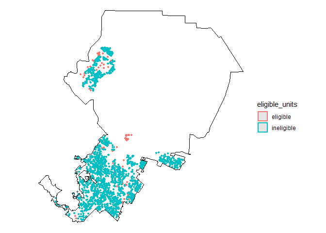
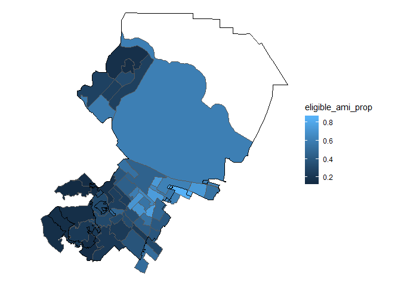
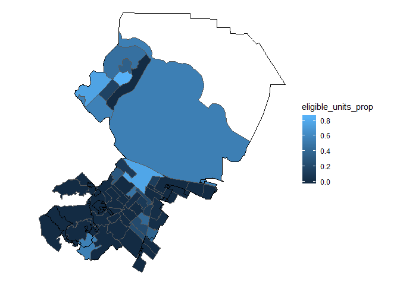
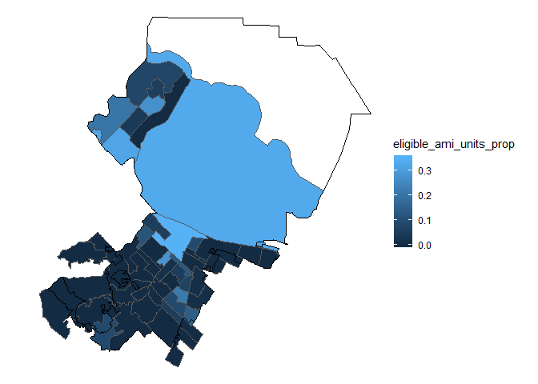

Tenant Relocation Assistance in Redwood City, CA
================
Your Name
2019-

  - [Purpose](#purpose)
  - [Data](#data)
      - [CoreLogic](#corelogic)
      - [ACS](#acs)
      - [Spatial Data](#spatial-data)
  - [Housing Stock](#housing-stock)
  - [Household Incomes](#household-incomes)
  - [Housing Stock by Block Group](#housing-stock-by-block-group)
  - [Eligibility](#eligibility)
  - [Answers](#answers)

``` r
# Libraries
library(tidyverse)
library(readxl)
library(sf)

# If you will not be providing answers, simply delete the following lines.
# Parameters
  # File where generated answers are saved, by default in the home directory
file_answers <- "~/answers.rds"

file_data_dic <- "C:/Users/katea/GitHub/dcl-2020-01/kate/c01-own/data-raw/Bulk_Tax_Current_Layout w parcel level lat long_03102016.xlsx"
file_cl_rwc <- "C:/Users/katea/GitHub/dcl-2020-01/kate/c01-own/data/cl_city_redwood.rds"

file_acs_rwc <- "C:/Users/katea/GitHub/dcl-2020-01/kate/c01-own/data/acs_rwc.rds"

file_boundaries_cbg_rwc <- "C:/Users/katea/GitHub/dcl-2020-01/kate/c01-own/data/boundaries_cbg_city_redwood.rds"
file_boundaries_city_rwc <- "C:/Users/katea/GitHub/dcl-2020-01/kate/c01-own/data/boundaries_city_redwood.rds"

  # Save answers
SAVE_ANSWERS <- TRUE
```

## Purpose

There is a tenant protection policy called *tenant relocation
assistance* that is becoming increasingly popular among Bay Area cities.
In short, when tenants are evicted for certain reasons, the policy
requires landlords to pay 3-months rent to tenants to assist with their
move. However, organizers have concerns that the policy eligibility does
not cover tenants who need it most.

Many tenant relocation assistance policies have *means-testing*, or
proof that tenants make below a certain income threshold, and
restrictions based on the number of housing units. Since this data does
not exist cross-tabbed, we will combine income data from the ACS with
property data from CoreLogic to best estimate eligibility across the
city.

In this challenge, we will analyze one city’s tenant relocation
assistance policy and determine its coverage.

## Data

### CoreLogic

This challenge relies on 2019 tax data for Redwood City from
[CoreLogic](www.corelogic.com), which has been cleaned and normalized
from U.S. County Assessor offices. The property data is permitted for
Stanford Users through the
[library](https://searchworks.stanford.edu/view/11416021). After I was
granted authorization, I downloaded the data for California, filtered
for Redwood City by fips code, selected variables with fewer than 25%
missing values, changed variable names to tidyverse format, and
converted to an sf object. The resulting rds file is saved as
`file_cl_rwc` in parameters.

### ACS

This challenge also uses data from the most recent American Community
Survey (ACS) data (2018, 5-year estimates) to get household income data
from table B19001 at the census block group level. For convenience, this
data has been downloaded using tidycensus, filtered for Redwood City,
and uploaded as `file_acs_rwc`. This is the list of the variables:

  - ‘B19001\_001’ - Total
  - ‘B19001\_002’ - Less than $10 000
  - ‘B19001\_003’ - $10 000 to $14 999
  - ‘B19001\_004’ - $15 000 to $19 999
  - ‘B19001\_005’ - $20 000 to $24 999
  - ‘B19001\_006’ - $25 000 to $29 999
  - ‘B19001\_007’ - $30 000 to $34 999
  - ‘B19001\_008’ - $35 000 to $39 999
  - ‘B19001\_009’ - $40 000 to $44 999
  - ‘B19001\_010’ - $45 000 to $49 999
  - ‘B19001\_011’ - $50 000 to $59 999
  - ‘B19001\_012’ - $60 000 to $74 999
  - ‘B19001\_013’ - $75 000 to $99 999
  - ‘B19001\_014’ - $100 000 to $124 999
  - ‘B19001\_015’ - $125 000 to $149 999
  - ‘B19001\_016’ - $150 000 to $199 999
  - ‘B19001\_017’ - $200 000 or more

### Spatial Data

Since we will be visualizing this data, we will also be using the
boundaries for census block groups in Redwood City
(`file_boundaries_cbg_rwc`) and the municipal boundary for Redwood City
(`file_boundaries_city_rwc`), which were downloaded using the [tigris
package](https://www.rdocumentation.org/packages/tigris/versions/0.9.2).
Since census block groups do not align with municipal boundaries, I
filtered for block groups that are at least partially within Redwood
City boundaries. For aesthetic purposes, we will also be using bodies of
water data downloaded from [Stanford
Earthworks](https://earthworks.stanford.edu/catalog/stanford-qh320kj0191).

## Housing Stock

**q1.1** The data dictionary for the CoreLogic data is in an Excel
(.xlsx) document `file_data_dic`. Use the `readxl` package (part of the
tidyverse) to read in the sheets with the documentation for the variable
“LAND USE”. Save the values as “luse\_code” and the descriptions as
“luse\_desc”. Save as `q1.1`.

``` r
q1.1 <- 
  file_data_dic %>% 
  read_excel(sheet = "LUSE") %>% 
  transmute(
    luse_code = as.double(`CdVal`),
    luse_desc = `CdDesc`
  )

# Print results
if (exists("q1.1")) q1.1
```

    ## # A tibble: 277 x 2
    ##    luse_code luse_desc          
    ##        <dbl> <chr>              
    ##  1         0 TYPE UNKNOWN       
    ##  2       100 RESIDENTIAL (NEC)  
    ##  3       102 TOWNHOUSE/ROWHOUSE 
    ##  4       103 APARTMENT/HOTEL    
    ##  5       106 APARTMENT          
    ##  6       109 CABIN              
    ##  7       111 COOPERATIVE        
    ##  8       112 CONDOMINIUM        
    ##  9       113 CONDOMINIUM PROJECT
    ## 10       114 COMMON AREA        
    ## # ... with 267 more rows

**q1.2** Read in `file_cl_rwc` and join with data from q1. Look over the
`file_data_dic` and filter for residential properties using
`property_indicator`.

``` r
q1.2 <- 
  file_cl_rwc %>% 
  read_rds() %>% 
  filter(property_indicator %in% 10:19) %>% 
  left_join(q1.1, by = c("land_use" = "luse_code"))

# Print results
if (exists("q1.2")) q1.2
```

    ## Simple feature collection with 2483 features and 66 fields
    ## geometry type:  POINT
    ## dimension:      XY
    ## bbox:           xmin: -122.2761 ymin: 37.44864 xmax: -122.1836 ymax: 37.54823
    ## epsg (SRID):    4269
    ## proj4string:    +proj=longlat +datum=NAD83 +no_defs
    ## # A tibble: 2,483 x 67
    ##    fips_code unformatted_apn apn_sequence_nbr formatted_apn original_apn
    ##    <chr>     <chr>                      <dbl> <chr>         <chr>       
    ##  1 06081     058357040                      1 058-357-040   058357040   
    ##  2 06081     069123300                      1 069-123-300   069123300   
    ##  3 06081     134161251                      1 134-161-251   134161251   
    ##  4 06081     134161260                      1 134-161-260   134161260   
    ##  5 06081     134161280                      1 134-161-280   134161280   
    ##  6 06081     134161290                      1 134-161-290   134161290   
    ##  7 06081     134161310                      1 134-161-310   134161310   
    ##  8 06081     134161321                      1 134-161-321   134161321   
    ##  9 06081     134161330                      1 134-161-330   134161330   
    ## 10 06081     134162020                      1 134-162-020   134162020   
    ## # ... with 2,473 more rows, and 62 more variables: `p-id-iris-frmtd` <chr>,
    ## #   total_value_calculated_ind <chr>, land_value_calculated_ind <chr>,
    ## #   improvement_value_calculated_ind <chr>, situs_state <chr>,
    ## #   owner1_last_name <chr>, mail_city <chr>, mail_state <chr>,
    ## #   `parcel_level_latitude_(2.6)` <dbl>, `parcel_level_longitude_(3.6)` <dbl>,
    ## #   mail_zip_code <chr>, census_tract <dbl>, mail_street_name <chr>,
    ## #   tax_code_area <dbl>, land_use <dbl>, property_indicator <chr>,
    ## #   county_use1 <chr>, land_square_footage <dbl>, acres <dbl>,
    ## #   mail_carrier_code <chr>, situs_city <chr>, situs_zip_code <dbl>,
    ## #   situs_street_name <chr>, assessed_year <dbl>, total_value_calculated <dbl>,
    ## #   assd_total_value <dbl>, tax_amount <dbl>, tax_year <dbl>,
    ## #   land_value_calculated <dbl>, assd_land_value <dbl>,
    ## #   mail_house_number <dbl>, situs_mode <chr>, situs_house_number <dbl>,
    ## #   situs_carrier_code <chr>, mail_mode <chr>, assd_improvement_value <dbl>,
    ## #   improvement_value_calculated <dbl>, absentee_owner_status <chr>,
    ## #   number_of_units <dbl>, universal_building_square_feet <dbl>,
    ## #   building_square_feet_ind <chr>, building_square_feet <dbl>,
    ## #   year_built <dbl>, lot_number <chr>, stories_number <dbl>, `batch-id` <dbl>,
    ## #   `batch-seq` <dbl>, document_type <chr>, transaction_type <dbl>,
    ## #   total_baths_calculated <dbl>, recording_date <dbl>, total_baths <dbl>,
    ## #   total_rooms <dbl>, bedrooms <dbl>, living_square_feet <dbl>,
    ## #   `owner1_first_name_&_mi` <chr>, sale_code <chr>, seller_name <chr>,
    ## #   sale_price <dbl>, residential_model_indicator <chr>, geometry <POINT [°]>,
    ## #   luse_desc <chr>

**q1.3** With this universe of residential properties in Redwood City,
count the land uses and arrange descending. Save as `q1.3`. What can we
say about the housing stock in Redwood City?

``` r
q1.3 <- 
  q1.2 %>% 
  count(land_use, luse_desc, sort = TRUE)

# Print results
if (exists("q1.3")) q1.3
```

    ## Simple feature collection with 6 features and 3 fields
    ## geometry type:  GEOMETRY
    ## dimension:      XY
    ## bbox:           xmin: -122.2761 ymin: 37.44864 xmax: -122.1836 ymax: 37.54823
    ## epsg (SRID):    4269
    ## proj4string:    +proj=longlat +datum=NAD83 +no_defs
    ## # A tibble: 6 x 4
    ##   land_use luse_desc          n                                         geometry
    ##      <dbl> <chr>          <int>                                   <GEOMETRY [°]>
    ## 1      163 SFR             1870 MULTIPOINT ((-122.2761 37.45943), (-122.2759 37~
    ## 2      112 CONDOMINIUM      524 MULTIPOINT ((-122.2616 37.45116), (-122.2609 37~
    ## 3      137 MOBILE HOME       74 MULTIPOINT ((-122.2031 37.48757), (-122.201 37.~
    ## 4      102 TOWNHOUSE/ROW~    12 MULTIPOINT ((-122.2539 37.46461), (-122.2518 37~
    ## 5      111 COOPERATIVE        2                        POINT (-122.227 37.45935)
    ## 6      100 RESIDENTIAL (~     1                       POINT (-122.2241 37.47086)

There are single-family residences in Redwood City, which is the
majority of the housing stock.

**q1.4** Redwood City’s tenant relocation assistance policy restricts
which rental units are eligible for assistance. On the city’s [renter
protections
webpage](https://www.redwoodcity.org/departments/community-development-department/planning-housing/renter-protections)
under “Relocation Assistance Highlights” it says:

> Rental units not included in the City’s ordinance include a room or
> any portion of a residential unit which is occupied by the landlord, a
> mobile home, properties of four or fewer dwelling units located on one
> lot, including single-family, duplex, tri-plex, or four-plex homes and
> accessory dwellings, mobile homes or housing accommodation in hotels,
> motels, etc.

Based on these criteria, determine the proportion of properties that are
eligible for tenant relocation assistance. Add another variable to
`q1.2` called `eligible_units`

``` r
q1.4 <- 
  q1.2 %>% 
  mutate(
    eligible_units = if_else(land_use %in% c(163, 137, 102), "ineligible", "eligible")
  )

# Print results
if (exists("q1.4")) q1.4
```

    ## Simple feature collection with 2483 features and 67 fields
    ## geometry type:  POINT
    ## dimension:      XY
    ## bbox:           xmin: -122.2761 ymin: 37.44864 xmax: -122.1836 ymax: 37.54823
    ## epsg (SRID):    4269
    ## proj4string:    +proj=longlat +datum=NAD83 +no_defs
    ## # A tibble: 2,483 x 68
    ##    fips_code unformatted_apn apn_sequence_nbr formatted_apn original_apn
    ##  * <chr>     <chr>                      <dbl> <chr>         <chr>       
    ##  1 06081     058357040                      1 058-357-040   058357040   
    ##  2 06081     069123300                      1 069-123-300   069123300   
    ##  3 06081     134161251                      1 134-161-251   134161251   
    ##  4 06081     134161260                      1 134-161-260   134161260   
    ##  5 06081     134161280                      1 134-161-280   134161280   
    ##  6 06081     134161290                      1 134-161-290   134161290   
    ##  7 06081     134161310                      1 134-161-310   134161310   
    ##  8 06081     134161321                      1 134-161-321   134161321   
    ##  9 06081     134161330                      1 134-161-330   134161330   
    ## 10 06081     134162020                      1 134-162-020   134162020   
    ## # ... with 2,473 more rows, and 63 more variables: `p-id-iris-frmtd` <chr>,
    ## #   total_value_calculated_ind <chr>, land_value_calculated_ind <chr>,
    ## #   improvement_value_calculated_ind <chr>, situs_state <chr>,
    ## #   owner1_last_name <chr>, mail_city <chr>, mail_state <chr>,
    ## #   `parcel_level_latitude_(2.6)` <dbl>, `parcel_level_longitude_(3.6)` <dbl>,
    ## #   mail_zip_code <chr>, census_tract <dbl>, mail_street_name <chr>,
    ## #   tax_code_area <dbl>, land_use <dbl>, property_indicator <chr>,
    ## #   county_use1 <chr>, land_square_footage <dbl>, acres <dbl>,
    ## #   mail_carrier_code <chr>, situs_city <chr>, situs_zip_code <dbl>,
    ## #   situs_street_name <chr>, assessed_year <dbl>, total_value_calculated <dbl>,
    ## #   assd_total_value <dbl>, tax_amount <dbl>, tax_year <dbl>,
    ## #   land_value_calculated <dbl>, assd_land_value <dbl>,
    ## #   mail_house_number <dbl>, situs_mode <chr>, situs_house_number <dbl>,
    ## #   situs_carrier_code <chr>, mail_mode <chr>, assd_improvement_value <dbl>,
    ## #   improvement_value_calculated <dbl>, absentee_owner_status <chr>,
    ## #   number_of_units <dbl>, universal_building_square_feet <dbl>,
    ## #   building_square_feet_ind <chr>, building_square_feet <dbl>,
    ## #   year_built <dbl>, lot_number <chr>, stories_number <dbl>, `batch-id` <dbl>,
    ## #   `batch-seq` <dbl>, document_type <chr>, transaction_type <dbl>,
    ## #   total_baths_calculated <dbl>, recording_date <dbl>, total_baths <dbl>,
    ## #   total_rooms <dbl>, bedrooms <dbl>, living_square_feet <dbl>,
    ## #   `owner1_first_name_&_mi` <chr>, sale_code <chr>, seller_name <chr>,
    ## #   sale_price <dbl>, residential_model_indicator <chr>, geometry <POINT [°]>,
    ## #   luse_desc <chr>, eligible_units <chr>

**q1.5** Make an EDA plot using `geom_sf` of the eligible units. Plot
the municipal boundary for reference.

``` r
q1.5 <-  
  q1.4 %>% 
  ggplot() +
  geom_sf(aes(color = eligible_units), size = 1) +
  geom_sf(data = file_boundaries_city_rwc %>% read_rds(), color = "black", fill = NA, size = 0.2) +
  theme_void()

# Print results
if (exists("q1.5")) q1.5
```

<!-- -->

## Household Incomes

**q2.1** For a more accurate depiction of eligiblity, we should analyze
the incomes at the threshold determined by Redwood City’s relocation
assistance policy. As stated on the website:

> Eligible residential households include a displaced residential
> household whose annual income **does not exceed eighty percent of the
> area median household income** for San Mateo County as adjusted for
> household size according to the United States Department of Housing
> and Urban Development and whose rental payments to the landlord remain
> current through the date of displacement. \[^1\]

The city’s area median household income (AMI) limits can be found
[here](https://www.redwoodcity.org/home/showdocument?id=16686) as well
as on the U.S. HUD website. AMI limits are determined by both income and
household size.

The average household size in Redwood City (according to ACS 2018 5-year
data) was 2.8 persons. For the purposes of this EDA analysis, we will
generalize to a household size of 3 across the entire city, meaning 80%
AMI is $105,700.

The ACS does not have household incomes with such precision, but we will
generalize 80% AMI to $100,000 and use this as our threshold. Using
`file_acs_rwc` Create a new variable `eligible_ami` that counts the
number of households making below $100,000 and a new variable
`eligible_ami_prop` for the proportion of eligibility.

Hint: Use regex to pick which columns to sum.

``` r
q2.1 <- 
  file_acs_rwc %>%
  read_rds() %>% 
  mutate(
    eligible_ami = 
      rowSums(select(., matches("00[2-9]$|01[1-3]$"))),
    eligible_ami_prop =
      eligible_ami / B19001_001
  )

# Print results
if (exists("q2.1")) q2.1
```

    ## # A tibble: 52 x 21
    ##    GEOID NAME  B19001_001 B19001_002 B19001_003 B19001_004 B19001_005 B19001_006
    ##    <chr> <chr>      <dbl>      <dbl>      <dbl>      <dbl>      <dbl>      <dbl>
    ##  1 0608~ Bloc~        557         18          0          0          0          0
    ##  2 0608~ Bloc~        544          0          0          0         34          0
    ##  3 0608~ Bloc~        773          0          0         36         23         11
    ##  4 0608~ Bloc~        881         39          7          0          0          9
    ##  5 0608~ Bloc~        290         32         10         38          0          0
    ##  6 0608~ Bloc~        633         24          0          9         10         20
    ##  7 0608~ Bloc~        257          0          0          0         10          0
    ##  8 0608~ Bloc~        507          0          0          9          0          9
    ##  9 0608~ Bloc~        413          9          9          0          0          0
    ## 10 0608~ Bloc~        649          0          0         10          9         19
    ## # ... with 42 more rows, and 13 more variables: B19001_007 <dbl>,
    ## #   B19001_008 <dbl>, B19001_009 <dbl>, B19001_010 <dbl>, B19001_011 <dbl>,
    ## #   B19001_012 <dbl>, B19001_013 <dbl>, B19001_014 <dbl>, B19001_015 <dbl>,
    ## #   B19001_016 <dbl>, B19001_017 <dbl>, eligible_ami <dbl>,
    ## #   eligible_ami_prop <dbl>

**q2.2** Based on these criteria, determine the proportion of properties
that are eligible for tenant relocation assistance.

``` r
q2.2 <- 
  weighted.mean(q2.1$eligible_ami_prop, w = q2.1$B19001_001)

# Print results
if (exists("q2.2")) q2.2
```

    ## [1] 0.4198889

**q2.3** Join the ACS data from q2.1 to census block group boundaries in
`file_boundaries_cbg_rwc` and turn it into an sf object.

``` r
q2.3 <- 
  q2.1 %>% 
  left_join(
    file_boundaries_cbg_rwc %>% read_rds(),
    by = "GEOID"
  ) %>% 
  st_as_sf()

# Print results
if (exists("q2.3")) q2.3
```

    ## Simple feature collection with 52 features and 32 fields
    ## geometry type:  MULTIPOLYGON
    ## dimension:      XY
    ## bbox:           xmin: -122.2924 ymin: 37.44205 xmax: -122.1616 ymax: 37.56053
    ## epsg (SRID):    4269
    ## proj4string:    +proj=longlat +datum=NAD83 +no_defs
    ## # A tibble: 52 x 33
    ##    GEOID NAME  B19001_001 B19001_002 B19001_003 B19001_004 B19001_005 B19001_006
    ##    <chr> <chr>      <dbl>      <dbl>      <dbl>      <dbl>      <dbl>      <dbl>
    ##  1 0608~ Bloc~        557         18          0          0          0          0
    ##  2 0608~ Bloc~        544          0          0          0         34          0
    ##  3 0608~ Bloc~        773          0          0         36         23         11
    ##  4 0608~ Bloc~        881         39          7          0          0          9
    ##  5 0608~ Bloc~        290         32         10         38          0          0
    ##  6 0608~ Bloc~        633         24          0          9         10         20
    ##  7 0608~ Bloc~        257          0          0          0         10          0
    ##  8 0608~ Bloc~        507          0          0          9          0          9
    ##  9 0608~ Bloc~        413          9          9          0          0          0
    ## 10 0608~ Bloc~        649          0          0         10          9         19
    ## # ... with 42 more rows, and 25 more variables: B19001_007 <dbl>,
    ## #   B19001_008 <dbl>, B19001_009 <dbl>, B19001_010 <dbl>, B19001_011 <dbl>,
    ## #   B19001_012 <dbl>, B19001_013 <dbl>, B19001_014 <dbl>, B19001_015 <dbl>,
    ## #   B19001_016 <dbl>, B19001_017 <dbl>, eligible_ami <dbl>,
    ## #   eligible_ami_prop <dbl>, STATEFP <chr>, COUNTYFP <chr>, TRACTCE <chr>,
    ## #   BLKGRPCE <chr>, NAMELSAD <chr>, MTFCC <chr>, FUNCSTAT <chr>, ALAND <dbl>,
    ## #   AWATER <dbl>, INTPTLAT <chr>, INTPTLON <chr>, geometry <MULTIPOLYGON [°]>

**q2.4** Make an EDA plot using `geom_sf` of the proportion of eligible
households by block group. Plot the municipal boundary for reference.

``` r
q2.4 <-  
  q2.3 %>% 
  ggplot() +
  geom_sf(aes(fill = eligible_ami_prop)) +
  geom_sf(data = file_boundaries_city_rwc %>% read_rds(), color = "black", fill = NA, size = 0.2) +
  theme_void()

# Print results
if (exists("q2.4")) q2.4
```

<!-- -->

## Housing Stock by Block Group

**q3.1** Spatially join the data from `q1.4` to `q2.3` by the number of
properties that fall within a block group. Then create a new variable
`eligible_units_cbg` that counts the number of eligible units in each
block group.

Hint: Use `st_intersects` and purr.

``` r
q3.1 <- 
  q2.3 %>% 
  mutate(
    eligible_units_cbg = map_int(
      st_intersects(., q1.4 %>% filter(eligible_units == "eligible")), 
      length
    ),
    total_units = map_int(
      st_intersects(., q1.4), 
      length
    ),
    eligible_units_prop = (eligible_units_cbg / total_units) %>% replace_na(0)
  )
```

    ## although coordinates are longitude/latitude, st_intersects assumes that they are planar
    ## although coordinates are longitude/latitude, st_intersects assumes that they are planar

``` r
# Print results
if (exists("q3.1")) q3.1
```

    ## Simple feature collection with 52 features and 35 fields
    ## geometry type:  MULTIPOLYGON
    ## dimension:      XY
    ## bbox:           xmin: -122.2924 ymin: 37.44205 xmax: -122.1616 ymax: 37.56053
    ## epsg (SRID):    4269
    ## proj4string:    +proj=longlat +datum=NAD83 +no_defs
    ## # A tibble: 52 x 36
    ##    GEOID NAME  B19001_001 B19001_002 B19001_003 B19001_004 B19001_005 B19001_006
    ##  * <chr> <chr>      <dbl>      <dbl>      <dbl>      <dbl>      <dbl>      <dbl>
    ##  1 0608~ Bloc~        557         18          0          0          0          0
    ##  2 0608~ Bloc~        544          0          0          0         34          0
    ##  3 0608~ Bloc~        773          0          0         36         23         11
    ##  4 0608~ Bloc~        881         39          7          0          0          9
    ##  5 0608~ Bloc~        290         32         10         38          0          0
    ##  6 0608~ Bloc~        633         24          0          9         10         20
    ##  7 0608~ Bloc~        257          0          0          0         10          0
    ##  8 0608~ Bloc~        507          0          0          9          0          9
    ##  9 0608~ Bloc~        413          9          9          0          0          0
    ## 10 0608~ Bloc~        649          0          0         10          9         19
    ## # ... with 42 more rows, and 28 more variables: B19001_007 <dbl>,
    ## #   B19001_008 <dbl>, B19001_009 <dbl>, B19001_010 <dbl>, B19001_011 <dbl>,
    ## #   B19001_012 <dbl>, B19001_013 <dbl>, B19001_014 <dbl>, B19001_015 <dbl>,
    ## #   B19001_016 <dbl>, B19001_017 <dbl>, eligible_ami <dbl>,
    ## #   eligible_ami_prop <dbl>, STATEFP <chr>, COUNTYFP <chr>, TRACTCE <chr>,
    ## #   BLKGRPCE <chr>, NAMELSAD <chr>, MTFCC <chr>, FUNCSTAT <chr>, ALAND <dbl>,
    ## #   AWATER <dbl>, INTPTLAT <chr>, INTPTLON <chr>, geometry <MULTIPOLYGON [°]>,
    ## #   eligible_units_cbg <int>, total_units <int>, eligible_units_prop <dbl>

**q3.2** Plot the `eligible_units_prop` with `q3.1`.

``` r
q3.1 %>% 
  ggplot() +
  geom_sf(aes(fill = eligible_units_prop)) +
  geom_sf(data = file_boundaries_city_rwc %>% read_rds(), color = "black", fill = NA, size = 0.2) +
  theme_void()
```

<!-- -->

## Eligibility

**q3.3** Create a new variable `eligible_ami_units_prop` for each block
group. Then create a presentation-style chloropleth map for percentages
eligible for TRA in each block group of the city.

``` r
q3.3 <- 
  q3.1 %>% 
  mutate(
    eligible_ami_units_prop = eligible_ami_prop * eligible_units_prop
  ) %>% 
  ggplot() +
  geom_sf(aes(fill = eligible_ami_units_prop)) +
  geom_sf(data = file_boundaries_city_rwc %>% read_rds(), color = "black", fill = NA, size = 0.2) +
  theme_void()

# Print results
if (exists("q3.3")) q3.3
```

<!-- -->

## Answers

To create an RDS file with answers, save all of your solutions in
variables such as `q1`, `q2.1`, etc. The following code will create an
answer file when you knit the solution.Rmd file. You specify where the
answer file is saved using the `file_answers` variable in the
parameters.

To provide answers, set `eval=TRUE` in the chunk below. If you will not
be providing answers, simply delete the following lines.

Save answers.

``` r
if (SAVE_ANSWERS) {
  ls(pattern = "^q[1-9][0-9]*(\\.[1-9][0-9]*)*$") %>%
    str_sort(numeric = TRUE) %>% 
    set_names() %>% 
    map(get) %>%
    discard(is.ggplot) %>%
    write_rds(file_answers)
}
```
